## Chapter 10 - UNIX, Linux and Android


### The history of UNIX and Linux

As this is history chapter I've decided to skip - otherwise I would have to rewrite the whole subchapter. If You're 
interested in the history there's a lot of material out there.


### Overview of Linux

I assume that the knowledge presented here is rather obvious, although I've decided to put notes here to make some 
kind of intro. Linux was mostly created by programmers for programmers, hence its philosophy to make it as useful to 
them as possible. That does not work well with an 'average user' trying to use it. Below is an overview of how the 
system is structured.


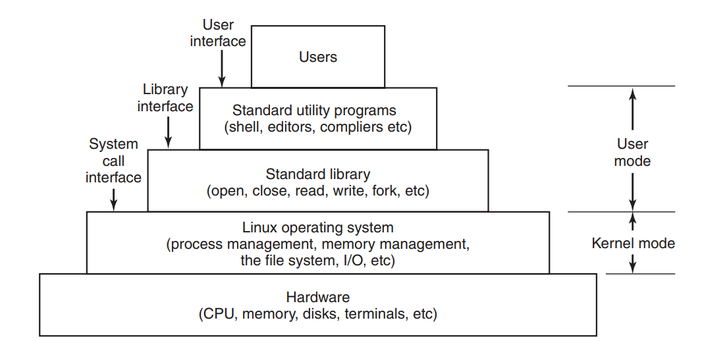

Kernel itself is the core of Linux, however to make it usable to the other programs, a set of *system calls* is 
present, that can be called from *C programs*. Additionally, Linux comes with a set of utils and apps, that are 
defined by *POSIX* standard or are separate from it. Today, very often users on desktops prefer to use *GUIs*, that 
are run with the *X11 window system* below, as it simplifies some trivial and popular task. However, the most 
powerful feature of Linux (and actually all UNIX-like systems) is *the shell*.

The most popular one is *BASH*, with a couple of others possible out there. By typing commands with proper arguments 
or flags, the applications are run and produce output. There are associated *I/O* with them - **standard output** 
(usually defaults to the screen), **standard input** (usually the keyboard, but chars are usually taken from the 
screen too) and **error stream** (also the screen). Commands are often chained in execution using *pipe* (which is |)
symbol, that takes output of one command and provides it as an input to the second one. That makes *shell* so powerful.
What is more, several commands can be grouped into a *shell script*, that stored in a file, can be moved around, 
shared and executed. Commands are in fact small programs, very often defined by the *POSIX*. Unfortunately it can 
result in a lot of legacy and boilerplate in them.

What mostly makes Linux, a Linux is its kernel - as this is the original system part that Linus Torvalds started. 
Below You can see an overview of it.

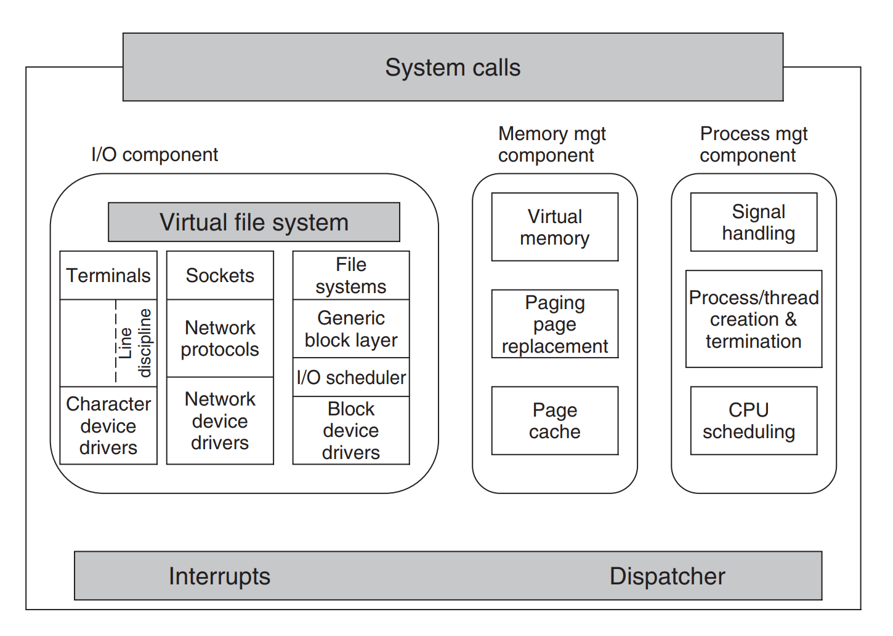


### Processes in Linux

Processes in general were discussed in chapter 2. However, Linux has its own nitty-gritty details which will be 
discussed here.

#### Fundamental concepts

When the process starts, it usually has only one *thread*, although it is possible (as we know already) for the 
process to start more of them. On every Linux machine, even during 'doing nothing', a lot of processes is run, 
usually *daemons*, that reside in the background waiting for some things to happen. Even if they weren't there, 
there's a special process called *idle* present, to occupy the CPU when no other process is running.

Every process has its identifier (called *PID*), with the top-level one (called *init*) having number *0*. Every 
time a process *forks* a child, the child inherits all the open resources the parent had, but is assigned a new 
*PID* in order to be easily differentiated. What is more - the processes can talk to each other. *Pipes* were 
already mentioned, although there's also additional type of communication - **signals**. The processes can send them,
although only to the members of the same **process group** (it includes all parents and children of the process). 
*POSIX* signals are listed below.


| Signal         | Cause  |
|----------------|--------|
| SIGABRT        | Sent to abort a process and force a core dump 
| SIGALRM        | The alarm clock has gone off
| SIGFPE         | A floating-point error has occurred (e.g., division by 0)
| SIGHUP         | The phone line the process was using has been hung up
| SIGILL         | The user has hit the DEL key to interrupt the process
| SIGQUIT        | The user has hit the key requesting a core dump
| SIGKILL        | Sent to kill a process (cannot be caught or ignored)
| SIGPIPE        | The process has written to a pipe which has no readers
| SIGSEGV        | The process has referenced an invalid memory address
| SIGTERM        | Used to request that a process terminate gracefully
| SIGUSR1        | Available for application-defined purposes
| SIGUSR2        | Available for application-defined purposes


#### Process-management system calls in Linux

Handling and managing processes is one of the core tasks of the OS. Therefore, it's not a surprise that there's a 
couple of *system calls* specifically designed to managed them. They are presented below.


| System call                          | Description  |
|--------------------------------------|--------------|
| pid = fork( )                        | Create a child process identical to the parent
| pid = waitpid(pid, &statloc, opts)   | Wait for a child (PID for specific or *-1* for any) to terminate
| s = execve(name, argv, envp)         | Replace a process’ core image
| exit(status)                         | Terminate process execution and return status
| s = sigaction(sig, &act, &oldact)    | Define action to take on signals
| s = sigreturn(&context)              | Return from a signal
| s = sigprocmask(how, &set, &old)     | Examine or change the signal mask
| s = sigpending(set)                  | Get the set of blocked signals
| s = sigsuspend(sigmask)              | Replace the signal mask and suspend the process
| s = kill(pid, sig)                   | Send a signal to a process
| residual = alarm(seconds)            | Set the alarm clock
| s = pause()                          | Suspend the caller until the next signal


The mostly used is *fork*, that actually creates a child of the current process. Usually just after the child is 
created, a parent blocks (using *waitpid* call). *Shell* used as an example for that usually must perform some job 
that is described by the provided command. To achieve that it spawns a child, and then the child calls *exec* to 
replace child core image with the command provided. A very simplistic shell inner-workings are presented below:

```c
while (TRUE) {                        /* repeat forever /*/
    type_prompt();                    /* display prompt on the screen */
    read_command(command, params);    /* read input line from keyboard */
    pid = fork( );                    /* fork off a child process */
    
    if (pid < 0) {
        printf("Unable to fork0);     /* error condition */
        continue;                     /* repeat the loop */
    }
    
    if (pid != 0) {
        waitpid (−1, &status, 0);     /* parent waits for child */
    } else {
        execve(command, params, 0);   /* child does the work */
    }
}
```

When process is done, it *exits*, providing in the parameter to the call the status that will be returned to the 
parent. All the remaining calls are related to sending signals between the processes and are pretty self-explanatory.


#### Implementation of processes and threads in Linux

> The Linux kernel internally represents processes as **tasks**, via the structure
*task_struct*. Unlike other OS approaches (which make a distinction between a
process, lightweight process, and thread), Linux uses the task structure to represent
any execution context. Therefore, a single-threaded process will be represented
with one task structure and a multithreaded process will have one task structure for
each of the user-level threads. Finally, the kernel itself is multithreaded, and has
kernel-level threads which are not associated with any user process and are executing kernel code. We will return to the treatment of multithreaded processes (and
threads in general) later in this section.
> 
> For each process, a process descriptor of type *task_struct* is resident in memory at all times. It contains vital 
> information needed for the kernel’s management of all processes, including scheduling parameters, lists of 
> open-file descriptors, and so on. The process descriptor along with memory for the kernel-mode stack for the
process are created upon process creation.


Process descriptor contains a lot of data about the process, and this data can be split into different categories 
(it's also a direct quote):

* **Scheduling parameters**. Process priority, amount of CPU time consumed recently, amount of time spent sleeping 
recently. Together,  these are used to determine which process to run next.
* **Memory image**. Pointers to the text, data, and stack segments, or
   page tables. If the text segment is shared, the text pointer points to the
   shared text table. When the process is not in memory, information
   about how to find its parts on disk is here too.
* **Signals**. Masks showing which signals are being ignored, which are
   being caught, which are being temporarily blocked, and which are in
   the process of being delivered.
* **Machine registers**. When a trap to the kernel occurs, the machine
   registers (including the floating-point ones, if used) are saved here.
* **System call state**. Information about the current system call, including the parameters, and results.
* **File descriptor table**. When a system call involving a file descriptor
   is invoked, the file descriptor is used as an index into this table to
   locate the in-core data structure (i-node) corresponding to this file.
* **Accounting**. Pointer to a table that keeps track of the user and system
   CPU time used by the process. Some systems also maintain limits
   here on the amount of CPU time a process may use, the maximum
   size of its stack, the number of page frames it may consume, and
   other items.
* **Kernel stack**. A fixed stack for use by the kernel part of the process.
* **Miscellaneous**. Current process state, event being waited for, if any,
   time until alarm clock goes off, PID, PID of the parent process, and
   user and group identification.
  
Having this knowledge we can now fully understand how *fork* works. When executed, it copies an existing process 
descriptor from the parent and does a couple of tweaks (choosing available PID, updates *task array*). Memory should 
be copied to ensure, that child does not mess with parent's data. However, as this is expensive, at the beginning 
Linux just redirects calls to child memory to the parent's. When *write* operation is performed on the child pages, 
there's a remapping happenning, the necessary page is copied and marked as *read-write*. 

Going back to the example of *shell* - when it creates a child in order to do some work, an *exec* is run. 
Parameters and env-variables are copied to the kernel, but that's all - in order to avoid unnecessary copying - the 
same approach as above is used for loading program's code into the memory. The pages are not loaded at the beginning 
(maybe besides *stack*), and are marked as *mapped file*. Right now when the program starts, it gets page-fault, 
which results in the first page being filled (read from the file on the disk). Only needed parts of the code will be 
therefore loaded into the memory during program's execution. At this stage, params/env-variables/counters are copied 
or zeroed, and a program is good to go. Below is an example of executing simple *LS* command.

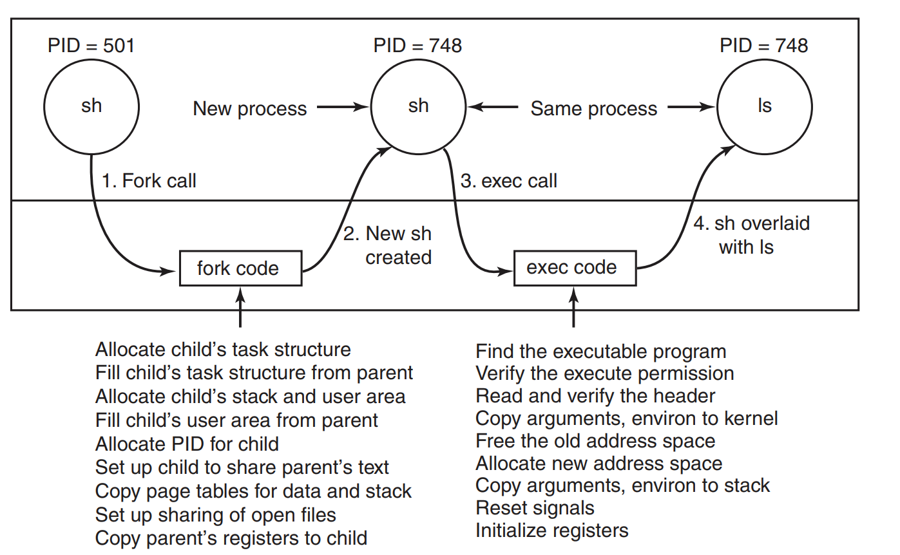


The last thing to discuss in this subchapter are *threads*. We know now how the processes are created, but what to 
do with the *threads* that are a part of this process? Should they be copied 1:1? What happens to them if one of 
them is blocked? Or holding a mutex? A lot of problems. In 2000 Linux introduced new kind - *clone* system call. It 
enables the programmer to create a thread and deciding at the time, what inheritance model should be used. The call 
looks like this.

```c
pid = clone(function, stack_ptr, sharing_flags, arg);
```

Don't be fulled by the usage of *PID* as a return value! Depending on the value of *sharing_flags* we get new 
process or a thread in a new process (that's why here *PID* is returned). Examples of values provided as 
*sharing_flags* (it's a bitmap) are provided below. Here *arg* is parameter to the *function* that the new 
thread/process will start with. *stack_ptr* is a pointer to the new *stack* that is assigned to the new 
process/thread.  


| Sharing flag        | Meaning when set                                          | Meaning when cleared         |
|---------------------|-----------------------------------------------------------|------------------------------|
| CLONE_VM            | Create a new thread                                       | Create a new process 
| CLONE_              | FS Share umask, root, and working dirs                    | Do not share them
| CLONE_FILES         | Share the file descriptors                                | Copy the file descriptors
| CLONE_SIGHAND       | Share the signal handler table                            | Copy the table
| CLONE_PARENT        | New thread has same parent as the caller                  | New thread’s parent is caller

What is worth mentioning - aside from *PID*, Linux also maintains *TID*, which is **task id**, that represents 
thread in the process.


#### Scheduling in Linux

Linux uses *kernel threads*, and they're the base for scheduling, not processes. We have three types of them:

* **Real-time FIFO** - they have the top priority.
* **Real-time round robin** - they are the same like **real-time FIFO**, however are **preemtable** by the clock 
  (the have predefined time quanta after which they're interrupted and put on hold).
* **Timesharing** - 'normal' threads.

The two first aren't actually 'real-time', but they conform to *P1003.4 standard (UNIX real-time)*, hence the name. 
They are represented internally by a **priority** ranging from *0* to *99* (being the highest order). **Timesharing 
threads** are assigned **priorities** *100-139*. Threads can be scheduled based on the amount clock ticks, which in 
the modern Linux can be fully customised based on the needs. The last value to describe is **niceness**, which can 
be set on a thread/process and ranges from *-20* to *+19*. It indicates **niceness** which means how this specific 
process want be 'nice' to other processes. In other words - it indicates how the process is Ok with giving the 
control to other processes.

When it comes to scheduling, the most basic concept is **runqueue**, which is a list of all the runnables in the 
system (it's created and maintained per CPU!). The first **scheduling algorithm** we are going to see is historical 
**O(1) scheduler**, which was named after the fact, that no matter the size of runnables list, was performing the 
scheduling in the same time. It is depicted below. 

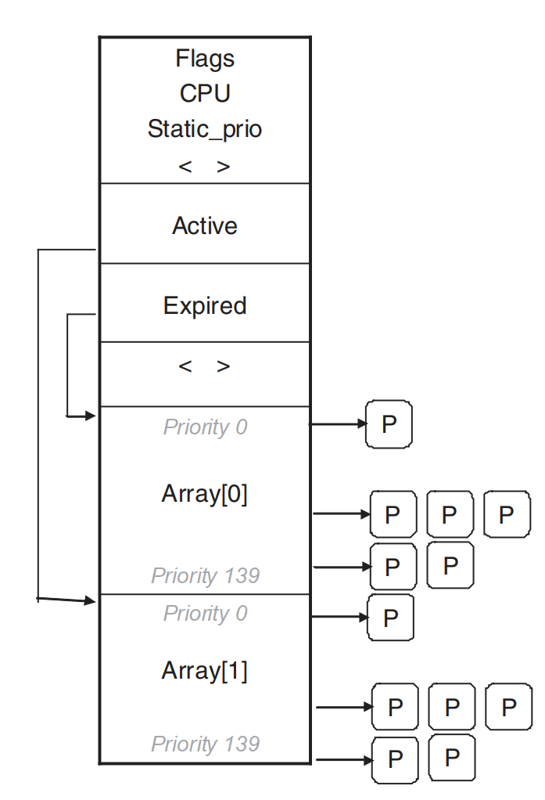

The idea is to have two lists - one with *active* runnables and second one with *expired* ones. We got separate 
*140* identifiers (one for every priority value), being entry points for a linked list of runnables. How it is 
exactly working is described below.

> The scheduler selects a task from the highest-priority list in the active array. If
that task’s timeslice (quantum) expires, it is moved to the expired list (potentially
at a different priority level). If the task blocks, for instance to wait on an I/O event,
before its timeslice expires, once the event occurs and its execution can resume, it
is placed back on the original active array, and its timeslice is decremented to
reflect the CPU time it already used. Once its timeslice is fully exhausted, it, too,
will be placed on the expired array. When there are no more tasks in the active
array, the scheduler simply swaps the pointers, so the expired arrays now become
active, and vice versa. This method ensures that low-priority tasks will not starve
(except when real-time FIFO threads completely hog the CPU, which is unlikely).
Here, different priority levels are assigned different timeslice values, with
higher quanta assigned to higher-priority processes. For instance, tasks running at
priority level 100 will receive time quanta of 800 msec, whereas tasks at priority
level of 139 will receive 5 msec.

What is more - to the above the scheduler adds some **static and dynamic priority**. The main goal of the scheduler 
is to get processes from the kernel ASAP. So for the IO-heavy processes (that run for a short amount of time, and 
then usually blocks), they add additional 'bonus', called **dynamic priority**. It is based on the computation of 
how often the process blocks or is preempted. If that happens often, the process is promoted to be run more often. 
The 'bonus' is an integer in a range from *-5* to *5*.

Although it seems to be fine, the performance of the above scheduler wasn't that nice. Therefore, from kernel *2.6.
23*, for non-realtime tasks a new scheduler is used, called **Completly Fair Scheduler (CFS)** and its structure is 
presented below.

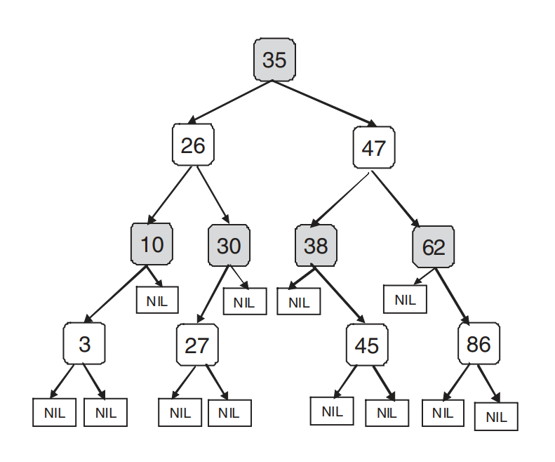

> The scheduling algorithm can be summarized as follows. CFS always schedules the task which has had least amount of time on the CPU, typically the leftmost
node in the tree. Periodically, CFS increments the task’s *vruntime value* based on
the time it has already run, and compares this to the current leftmost node in the
tree. If the running task still has smaller *vruntime*, it will continue to run. Otherwise, it will be inserted at 
> the appropriate place in the red-black tree, and the CPU
will be given to task corresponding to the new leftmost node.
To account for differences in task priorities and ‘‘niceness,’’ CFS changes the
effective rate at which a task’s virtual time passes when it is running on the CPU.
For lower-priority tasks, time passes more quickly, their *vruntime* value will increase more rapidly, and, depending 
> on other tasks in the system, they will lose the
CPU and be reinserted in the tree sooner than if they had a higher priority value. In
this manner, CFS avoids using separate runqueue structures for different priority
levels.

To finish the concept of scheduling - the tasks that are waiting on the IO, are put on the **waitqueue**, which is a 
list of such tasks with a *spinlock*, that guarantees the ability to modify it by both interrupts and kernel code.
The last thing to describe is **synchronization**, however the output of this section can be simple statement, that 
Linux uses barriers, mutexes, semaphores and all other stuff depending on the level and needs. 


#### Booting Linux

The problem with this subchapter is that right now, in the modern computers aforementioned 
**MBR (Master Boot Record)** is somehow a thing of the past, with **GPT** and **UEFI** taking over. However, in 
general the concept of startup of the OS is the same, so I will describe the older solution. After **BIOS** is 
started, it uses the beginning of the **boot disk** (which is **MBR**) to load **boot** program. This program's job 
is to be copied to predefined memory place and then to get access to the root directory of the device that is being 
booted. To understand the filesystem there and structure of folders a **bootloader program** is used (in Linux world 
**GRUB** being the king now). **GRUB** loads the kernel (which startup and loading is written in assembly, and 
heavily relies on the platform) which then takes over. All the necessary part for the kernel are being setup right 
now - kernel stack, message buffer and in final - IO drivers. After all these are done, a first process is started - 
which is process with *PID 0*.

Next thing to do is to start two cornerstone-like processes - *init* with *PID 1* and *paging daemon* with *PID 2*. 
Depending on, whether target set to launch being *single user mode* or *multiuser mode*, appropriate shells/terminals 
are being run. With this finished, an OS is ready to work


### Memory management in Linux


To start with - memory in Linux that every program uses can be divided into three categories - **text, data** and 
**stack**. **Text** is an actual executable instructions of the program. They don't change. Second part is **data**, 
which stores program data (oh, really?), but can be divided into two parts. First one is called **BSS (Block Started 
by Symbol)**, which is an area reserved for the uninitialized constants or variables. Usually, only the length of 
this block is stored, no need to store a lot of zeros in the memory. The second part is **initialized data block**, 
that as its name suggests, stores variables that were initialized in the code when created. 

The last part is **stack**, where all calls to the functions are stored as **stack frames**, along with return 
addresses, local variables and so. Hmmm, wait a moment, where's the **heap**? Here the authors provide the answer, 
that it is a part of the **data segment**, and usually is situated right after **initialized/uninitialized** part. 
Below picture is taken from the book, the next one is taken from <a href="https://en.wikipedia.org/wiki/Data_segment">Wiki article about data segment</a>.


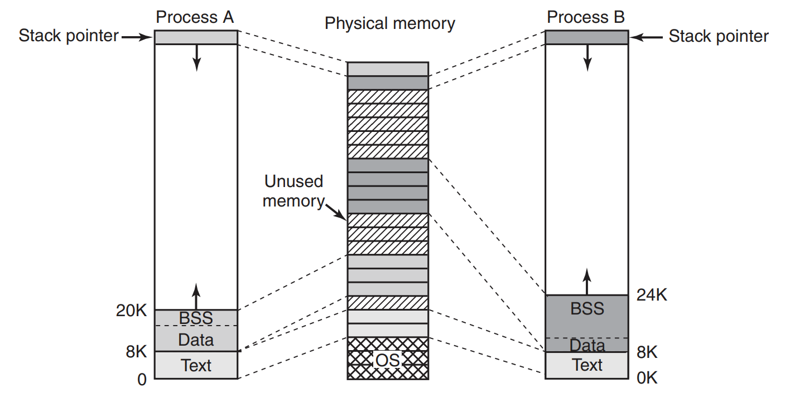

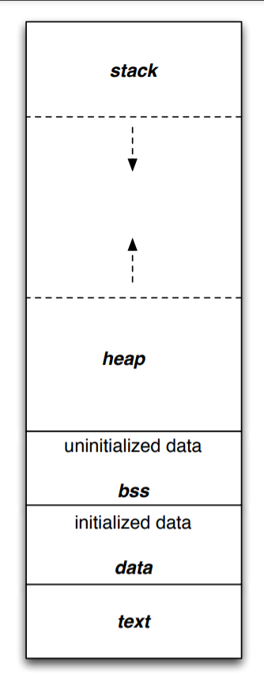


When it comes to memory we know one thing - it's fast, but it's always a good practice to skip accessing it using 
cache. There's often a situation when two users are using the same program at the same time - text editor for 
example. Their data are different of course, although, the binary itself is the same. Why then not reuse it for both 
users, and keep just one instance in the memory? That's what actually is being done, and the technique is called 
**shared text segment** (ingenious name ;) ). Second technique that is fast and can reduce the IO is **memory-mapped 
file**. *Dynamic libraries* are used that way - actual files on the disk are put in the memory, and accessed 
directly, without long-lasting IO operations. As many applications reuse the libraries, it can save quite a lot of 
disk operations.

System calls for memory management were actually not covered by *POSIX*, as it was seen as too machine-related. 
However, most of Linuxes has system calls for operating on the memory. The most popular ones are listed below.


| Call                                            | Description                                |
|-------------------------------------------------|--------------------------------------------|
| s = brk(addr)                                   | Change data segment size                         
| a = mmap(addr, len, prot, flags, fd, offset)    | Map a file in
| s = unmap(addr, len) Unmap a file               | Unmap a file


> [...] The return code *s* is *−1* if an error has occurred; *a* and *addr* are memory addresses, *len* is a
length, *prot* controls protection, *flags* are miscellaneous bits, *fd* is a file descriptor, and *offset* is a file 
> offset


#### Implementation of memory management in Linux

In general, *32bit* systems assign maximum of *3GBs* of memory per process, with *1GB* being assigned to the 
system/kernel. This kernel-memory is not seen in the user-mode, it becomes visible when process traps. For the 
*64bits* this memory is *128TB* of RAM - both for process and kernel (now we know why *64bits* are better). Due to 
hardware limits and differences, Linux divides the memory into three **zones**.

* **ZONE_DMA** or **ZOME_DMA32** - pages used for *DMA*
* **ZONE_NORMAL** - duh
* **ZONE_HIGHMEM** - it's used to map the memory that usually resides in userland, and will be remapped after the usage.

I assume here the direct quote will do the job.

> The exact boundaries and layout of the memory zones is architecture dependent. On *x86* hardware, certain devices 
> can perform *DMA* operations only in the first *16MB* of address space, hence *ZONE_DMA* is in the range *0–16 MB*.
> On *64-bit* machines there is additional support for those devices that can perform *32-bit DMA* operations, and 
> *ZONE_DMA32* marks this region. In addition, if the hardware, like older-generation *i386*, cannot directly map 
> memory addresses above *896 MB*, *ZONE_HIGHMEM* corresponds to anything above this mark. *ZONE_NORMAL* is
anything in between them. Therefore, on *32-bit x86* platforms, the first *896MB* of the Linux address space are 
> directly mapped, whereas the remaining *128 MB* of the kernel address space are used to access high memory regions.
> On *x86 64 ZONE HIGHMEM* is not defined.


The kernel and **memory map** are pinned - they are not remapped or paged out. The rest of the memory contains 
**page frames**. Below picture presents how it looks - we'll get into the details right after.

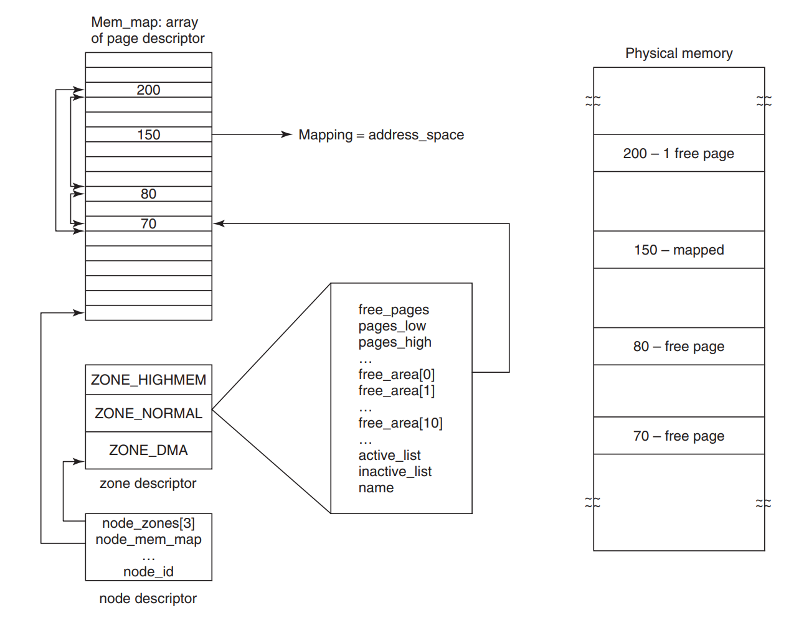


Again, direct quote will explain this best.

> First of all, Linux maintains an array of **page descriptors**, of type page one for each physical page frame in the 
> system, called *mem_map*. Each page descriptor contains a pointer to the address space that it belongs to, in case 
> the page is not free, a pair of pointers which allow it to form doubly linked lists with other descriptors, for 
> instance to keep together all free page frames, and a few other fields. The page descriptor for page *150* 
> contains a mapping to the address space the page belongs to. Pages *70*, *80*, and *200* are free, and they are 
> linked together. The size of the page descriptor is *32 bytes*, therefore the entire mem map can consume less than 
> 1% of the physical memory (for a page frame of *4 KB*). Since the physical memory is divided into zones, for each 
> zone Linux maintains a zone descriptor. The zone descriptor contains information about the memory utilization within
> each zone, such as number of active or inactive pages, low and high watermarks to be used by the page-replacement 
> algorithm described later in this chapter, as well as many other fields


From the above picture we can also see that every *zone descriptor* contains also an array of free areas. However, 
as we saw before, free pages are linked, and here the address *free_area[0]* will result in the pointer to the first 
block of pages, that has only **one page free**, and so on.
Next concept is **node descriptor** that was introduced to make sure, that Linux also works properly on *NUMA* 
machines. It's not very wise to scatter the data of one process through different nodes.
In order to support also both *32bit* and *64bit* architectures, starting from kernel *2.6.11*, a **four level 
paging scheme** is used. In such case it is easy to find a proper **page table** just following the pointers that 
upper levels contain.

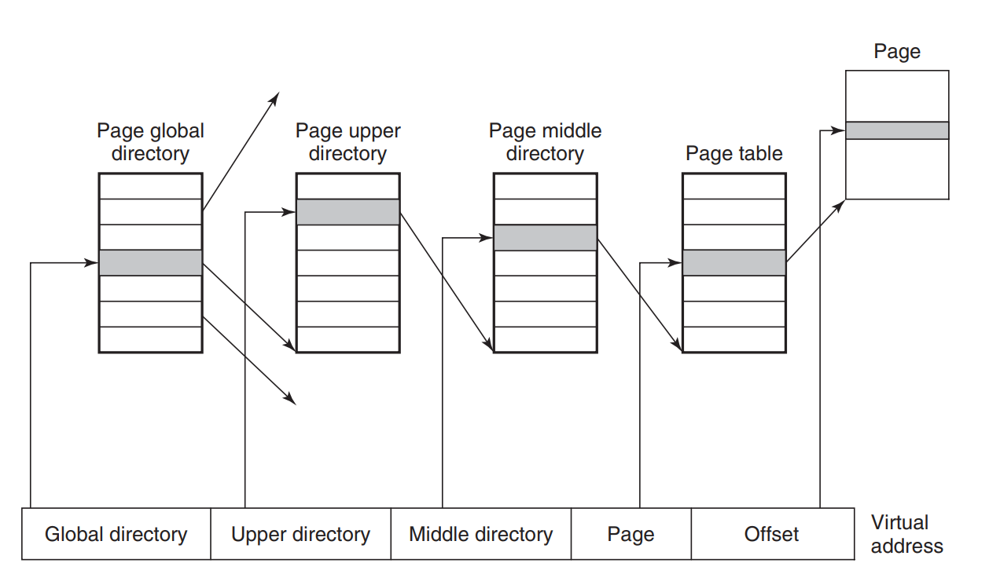


Now we'll take a look at how Linux allocates the memory, using **memory allocation algorithms**. We start with 
**buddy algorithm**. Let's take a look at the example memory usage increase.

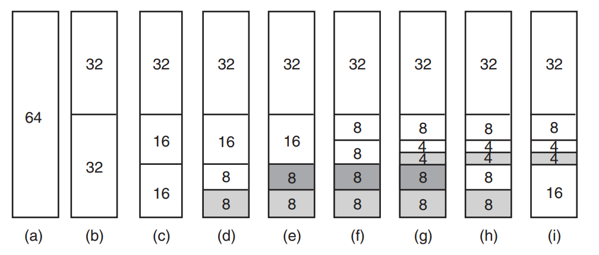

> The basic idea for managing a chunk of memory is as follows. Initially memory consists of a single contiguous piece, 64 pages in the simple example of
*(a)*. When a request for memory comes in, it is first rounded up to a power of 2, say eight pages. The full memory 
> chunk is then divided in half, as shown in *(b)*. Since each of these pieces is still too large, the lower piece is 
> divided in half again *(c)* and again *(d)*. Now we have a chunk of the correct size, so it is allocated to the 
> caller, as shown shaded in *(d)*. Now suppose that a second request comes in for eight pages. This can be satisfied 
> directly now *(e)*. At this point a third request comes in for four pages. The smallest available chunk is split 
> *(f)* and half of it is claimed *(g)*. Next, the second of the 8-page chunks is released *(h)*. Finally, the other 
> eight-page chunk is released. Since the two adjacent just-freed eight-page chunks came from the same
16-page chunk, they are merged to get the 16-page chunk back *(i)*.

Previously, I've mentioned *free_area* array in the *zone_descriptor* - it's an array containing a list of all the 
free pages with size *1*, then *2*, *4* and so on. Therefore, if a request comes for eg. size *4*, giving it back is 
trivial. The problem appears when request requires size *65* - then we would need to return 'next in line size', 
which is *128*, and waste a lot of memory. To address this problem, Linux has a second allocation - **slab 
allocator**, that takes the parts given by **budy algorithm** and cuts them in smaller pieces, called (obviously) 
**slabs**. 

As the kernel creates a lot of objects, it relies on **object caches**, which hold pointers to the free **slabs**, 
or the ones that are partially filled. Just when these are not available, it uses next fully empty **slab** or 
requests the next one being created. The third allocator is **vmalloc**. It is used when requested memory is needed 
to be contiguous in the virtual space, not in the physical space.

To finish this subchapter, a concept of **virtual address-space representation** is discussed. We've seen that in 
the picture presenting mapping between virtual memory that processes use, and a physical memory. An **area** is eg. 
text segment from one specific program. 

> Each area is described in the kernel by a *vm_area* struct entry. All the
*vm_area* structs for a process are linked together in a list sorted on virtual address so that all the pages can be 
> found. When the list gets too long (more than *32 entries*), a tree is created to speed up searching it. The 
> vm_area struct entry lists the area’s properties. These properties include the protection mode (e.g., read only or
read/write), whether it is pinned in memory (not pageable), and which direction it grows in (up for data segments, 
> down for stacks). The *vm_area* struct also records whether the area is private to the process or
shared with one or more other processes.


The *vm_area* struct also records if the **area** is backed by the binary file (for text segments), a file (for 
memory-mapped files) or is just 'normal' area, that should be backed by pagin out to the swap.


### Paging in Linux

Linux relies on the **swapper process**, that actually does not put the whole process on the disk when needed, but 
works on the **page frame level** - not only to save time, but also (as was shown above a couple of times), it can 
start a process without loading all its contents into the memory. **Page daemon** is run partially in the kernel and 
partially in the userspace (its PID is *2*). It's in general better to use dedicated **swap partition** for paging, 
as no additional mapping overhead (as is the case for 'normal' swap-files) is present. 

The algorithm used for paging (and keeping a couple of free pages in addition) is done using **PFRA (Page Frame 
Reclaiming Algorithm)**. 

> First of all, Linux distinguishes between four different types of pages: **unreclaimable**, **swappable**, 
> **syncable**, and **discardable**. **Unreclaimable** pages, which include reserved or locked pages, kernel mode 
> stacks, and the like, may not be paged out. **Swappable** pages must be written back to the swap area or the paging 
> disk partition before the page can be reclaimed. **Syncable** pages must be written back to disk if they have 
> been marked as dirty. Finally, **discardable** pages can be reclaimed immediately.

**Page daemon** is called *kswapd*, and is run separately for each memory zone. It wakes up from time to time and 
compares current state of memory with its desired state. If necessary, is starts paging process (usually up to *32* 
pages). **PFRA** starts with **discardable** pages first, then with **syncable**, and all up the chain. Low-hanging 
fruits gathering, as the authors put it. Clock-wise algorithm is backing this, to make sure that the oldest and not 
recently access/changed pages are swapped out (two flags are used for this - *active/inactive* and *referenced/not*).
We've seen previously, that in the zones a list of both free and used pages is present - the algorithm operates on 
them. The whole process is also depicted below.

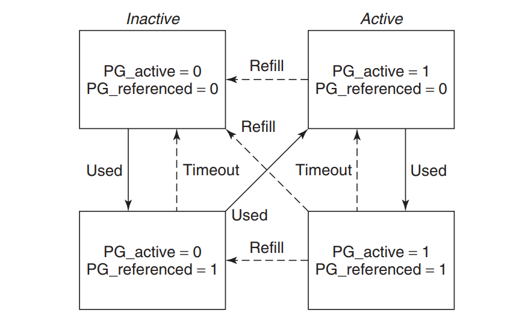

At the end what must be mentioned is *pdflush* daemon, which job is to actually flush the pages from the **page 
cache** to the disk. It wakes up periodically, or based on the memory watermarks being crossed. It can be tuned, 
especially for preserving the energy with **laptop mode** flag.


### Input/output in Linux

In general everything when it comes to *I/O* in Linux is a file - more or less special one. Devices are represented 
by the files in */dev* folder and can be additionally divided into two categories - **block files** and **character 
files**. The first ones as the name suggest consist of **blocks**, which can be read with varied-access (usually 
disks are represented like this). The second type - **character files** - are as the name says stream of characters. 
That applies to eg. printers, mice, etc. To handle a specific type of device file a **major** and **minor device 
number** is present - the first one identifying 'big things' (is it disk or printer), and **minor number** 
specifying smaller types/subtypes.


#### Networking

**Networking** in Linux is taken from *BSD*, and mostly revolves around **socket**. 

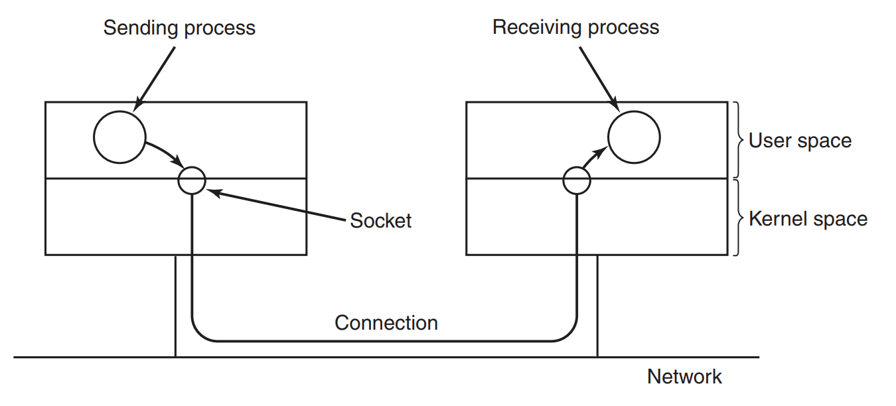


When it comes to connections, that are three types:

* **Reliable connection-oriented byte stream** - two sockets on different machines establish a connection, and send 
  data between them in the guaranteed order. **TCP** is an example of such stream. 
* **Reliable connection-oriented packet stream** - similar to the above, however data is send in packets (with 
  respect to their boundaries), not as one huge byte stream.
* **Unreliable packet transmission** - connection is established, but no guarantees is put on the order of the data 
- **UDP** being the best example.


#### Input/Output System Calls in Linux 

As it was mentioned before - almost all the *I/O* in Linux is done just by using the file abstraction. However, 
there are a couple of operations that cannot be achieved that way. Before *POSIX* was introduced, a call called 
*ioctl* was used for that, but it resulted in quite a mess during the years. Nowadays Linux implements them, but 
their specific way of implementations are different. 


| Call                                            | Description                                |
|-------------------------------------------------|--------------------------------------------|
| s = cfsetospeed(&termios, speed)                | Set the output speed (of terminal)
| s = cfsetispeed(&termios, speed)                | Set the input speed (of terminal)
| s = cfgetospeed(&termios, speed)                | Get the output speed (of terminal)
| s = cfgtetispeed(&termios, speed)               | Get the input speed (of terminal)
| s = tcsetattr(fd, opt, &termios)                | Set the attributes (special chars, eg. interrupt/line delete)
| s = tcgetattr(fd, &termios)                     | Get the attributes (special chars, eg. interrupt/line delete)


#### Implementation of I/O in Linux

*I/O* in Linux is done using **device drivers**, that are code that provide procedures that will be used when a 
specific **major/minor number version** pair is identified as a device file. Kernel internally keeps a hashed map of 
the pairs and decides which driver will be used to handle a specific device. Below is a matrix showing operations that 
must be supported and example devices for **character devices**.

| **Device**    |  **Open**    |   **Close**    |  **Read**     |  **Write**     |  **Ioctl**   |  **Other**  |         
|---------------|--------------|----------------|---------------|----------------|--------------|-------------|
| Null          | null         | null           | null          | null           | null         |    ...      | 
| Memory        | null         | null           | mem_read      | mem_write      | null         |    ...      |
| Keyboard      | k_open       | k_close        | k_read        | error          | k_ioctl      |    ...      |
| Tty           | tty_open     | tty_close      | tty_read      | tty_write      | tty_ioctl    |    ...      |
| Printer       | lp_open      | lp_close       | error         | lp_write       | lp_ioctl     |    ...      |


**Drivers** run partially in both - user and kernel mode. They're prohibited for making specific calls (eg. memory 
allocation and such) - the list of allowed calls is present in a document titled **Driver Kernel Interface**. We've 
mentioned two types of devices - **block** and **character**. We start with the description of **block devices**, 
which usually are disks.

The most crucial thing for **block devices** it so minimize the number of transfers from there - as they're way 
slower than eg. the memory. In order to achieve that during the years the amount of **cache** increased, resulting 
in the improved performance. However, when the cache is full, and something new must be put there, a replacing 
algorithm described in the previous subchapter is used. Below picture presents the architecture.

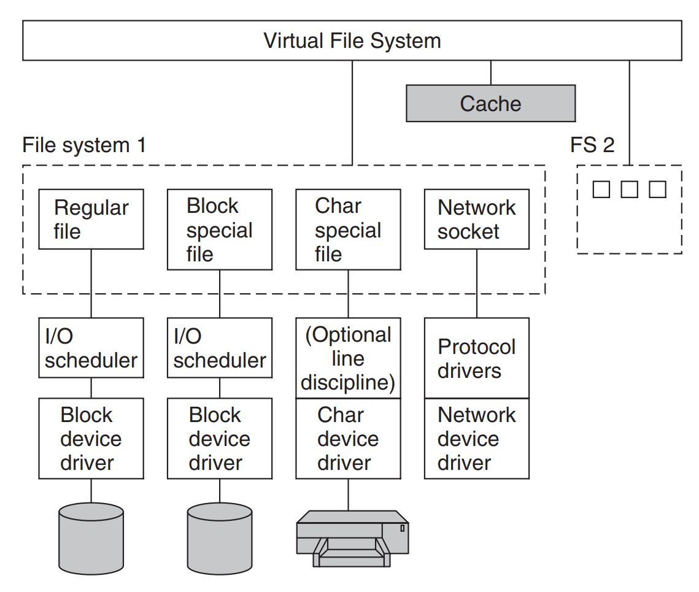

The cache also works for **writes**, a daemon described in a previous subchapter (*pdflush*) takes care of putting the 
data form the cache to the device. Another way to speed up the access to the **block devices** (when they're backed 
by oldschool rotational disks) is grouping of the operations that are located in the same location (to reduce disk 
head movement). This grouping is done by **I/O scheduler**, which type is **Linux elevator scheduler**.

> Disk operations are sorted in a doubly linked list, ordered by the address of
the sector of the disk request. New requests are inserted in this list in a sorted manner. This prevents repeated costly disk-head movements. The request list is subsequently merged so that adjacent operations are issued via a single disk request. The
basic elevator scheduler can lead to starvation. Therefore, the revised version of
the Linux disk scheduler includes two additional lists, maintaining read or write
operations ordered by their deadlines. The default deadlines are 0.5 sec for reads and 5 sec for writes. If a
about to expire, that write main doubly linked list.

To end up with the **block devices**, we have to mention **raw block files**, which are used to directly target the 
disk using block numbers or cylinders. They're used mostly for paging and systems maintaince.

**Character devices** are simple, as they operate on the raw stream of characters or bytes. The only thing 
interesting here is **line discipline**, that can be associated with the device and perform some special 
operations/tasks based on the predefined amount of data (eg. line in a terminal, hence the name). That's the way eg. 
newlines are being added and used in the terminals. To end up this subchapter - **network devices**, although being 
**character devices**, are a little bit different, due to their async nature. The main character here is **socket 
buffer structure**, that depending on the drivers being used (they are different for eg. different web protocols).


#### Modules in Linux

**Modules** are removable parts of code, that can be 'inserted' into the kernel on the fly. Back in a day kernel 
drivers were 'hardcoded' into the kernel, although with the rise of personal computers, the amount of peripherals 
got so big, that was no longer a case. Linux adopts the policy of **kernel module**. There's still *a lot* of 
drivers hardcoded into the kernel, however not that much as it could be.


### The Linux file system

Linux derives a lot of its filesystem from *MINIX 1* - but greatly improved (file name size, file size itself). 
*Ext* was the first version, however it still was not it - so the second version was created (reaching currently 
number *4*). But that's not all - **Linux Virtual File System** supports different 'physical' file systems, that can 
be used in parallel with different mount points in the system. 

Here some concepts, that were already discussed in <a href="https://github.com/chlebik/ModernOperatingSystems_AndrewTanenbaum/blob/main/Chapter_04/README.md">chapter 4</a> 
is described, so I'm skipping it. A new concept is the idea of **locking**, when it comes to the files. Linux in this 
regard is great, because it does not only, provide the possibility to **lock single files** but even bytes within them!

> Tw o kinds of locks are provided, **shared locks** and **exclusive locks**. If a portion of a file already contains a 
> shared lock, a second attempt to place a shared lock
on it is permitted, but an attempt to put an exclusive lock on it will fail. If a portion of a file contains an exclusive lock, all attempts to lock any part of that portion
will fail until the lock has been released. In order to successfully place a lock, every byte in the region to be 
> locked must be available.


**Locks** can overlap, but as long as they are **shared** or just **block** until they're acquired that's not a 
problem. Below is an example.

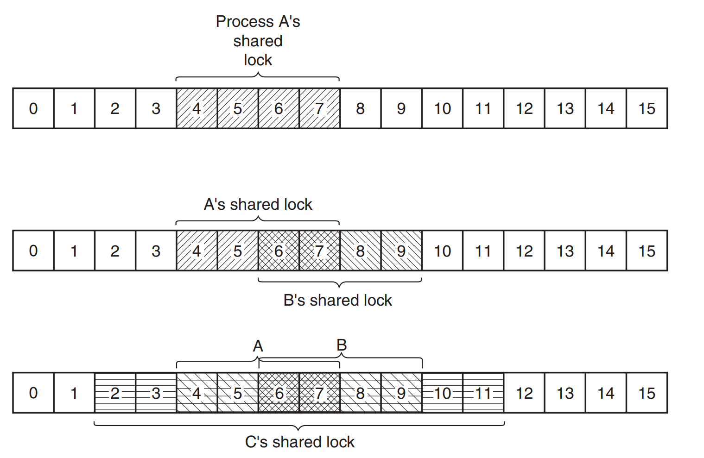


#### File-system calls in Linux

As we've seen in the previous subchapter - *I/O* in Linux is generally based on the files. It's not surprising that 
there's a lot of system calls related to the file-system then. There's a lot of them, but I will just provide this 
simple table, without extensive explanations.

| Call                                            | Description                                |
|-------------------------------------------------|--------------------------------------------|
| fd = creat(name, mode)                          | One way to create a new file (it's not misspelled)
| fd = open(file, how, ...)                       | Open a file for reading, writing, or both
| s = close(fd)                                   | Close an open file
| n = read(fd, buffer, nbytes)                    | Read data from a file into a buffer
| n = write(fd, buffer, nbytes)                   | Write data from a buffer into a file
| position = lseek(fd, offset, whence)            | Move the file pointer
| s = stat(name, &buf)                            | Get a file’s status information
| s = fstat(fd, &buf)                             | Get a file’s status information
| s = pipe(&fd[0])                                | Create a pipe
| s = fcntl(fd, cmd, ...)                         | File locking and other operations
| s = mkdir(path, mode)                           | Create a new directory
| s = rmdir(path)                                 | Remove a directory
| s = link(oldpath, newpath)                      | Create a link to an existing file
| s = unlink(path)                                | Unlink a file
| s = chdir(path)                                 | Change the working directory
| dir = opendir(path)                             | Open a directory for reading
| s = closedir(dir)                               | Close a directory
| dirent = readdir(dir)                           | Read one directory entry
| rewinddir(dir)                                  | Rewind a directory so it can be reread


#### Implementation of the Linux File System

**Linux Virtual File System** was designed to hide from the user the internals of accessed data. It is possible to 
have different filesystems in the system. What is more - the disks even do not have to be installed locally - they 
can be accessed using network. Below is a list with basic building blocks of it.


| Object                        | Description                                  | Operation
|-------------------------------|----------------------------------------------|-------------------------------------|
| Superblock                    | specific file-system                         | read_inode, sync_fs
| Dentry                        | directory entry, single component of a path  | create, link
| I-node                        | specific file                                | d_compare, d_delete
| File                          | open file associated with a process          | read, write


**Ext2** filesystem was already mentioned before, and as it is a base for heavily used today **ext4**, we start with 
it. The partition of the disk formatted with **ext2** looks like this.


* **superblock** - is crucial for getting the job done. It contains the layout of the filesystem, number of 
  *i-nodes*, and such.
* **group descriptor** - location of bitmaps, number of free blocks and *i-nodes* in the group
* **bitmaps** - contains information about free blocks and free *i-nodes*.
* **i-nodes** - just data, nothing more
* **data blocks**

**Directory file** is a file representing a directory. The structure of it can be seen below.


Every **directory entry** consists of four fixed-size fields and one of variable length:

* **i-node number**
* **rec_len** - contains info about the size of the entry
* **type**
* **file name length**
* **file name itself** - it's of variable size (not exceeding *255 chars*)

To speed up the search and traversal, **dentries** are cached by the kernel. The same applies to the *i-nodes*, when 
they are brought into memory (it is put in the **i-node table**). The amount of *i-node* properties is quite big. 
Below picture shows how the opening of file works.

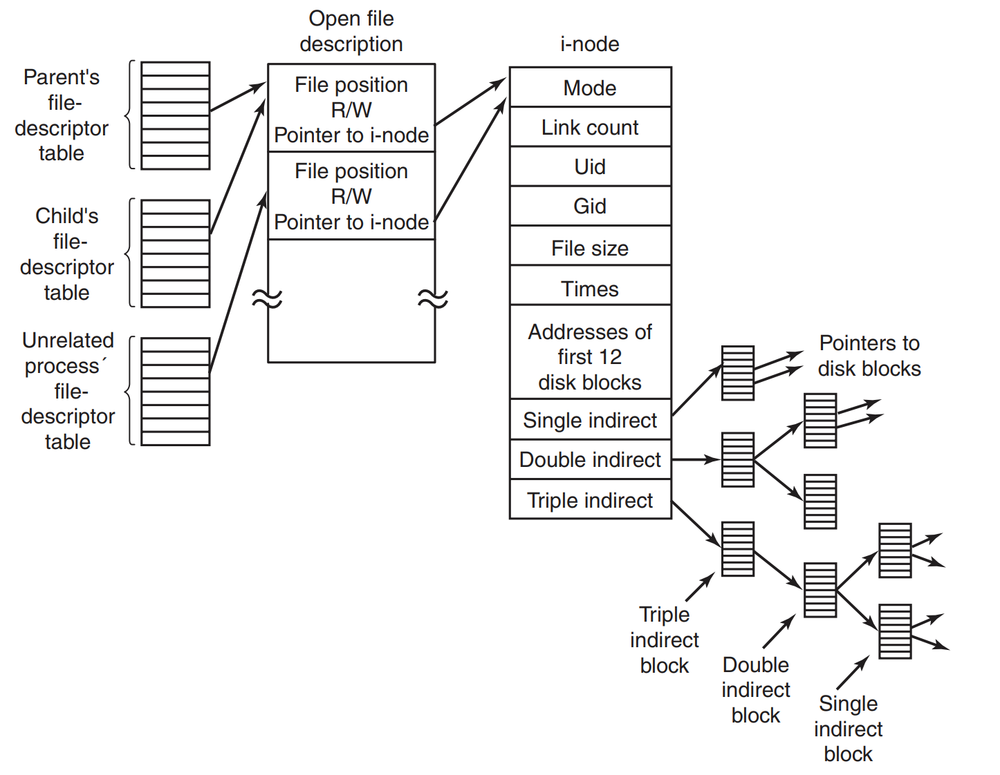

The thing here is **open-file-description table**, which is a middle man between user-related **file-descriptor's 
table** and **i-node table**. It was introduced to maintain clear separation between processes, that want to 
write/read the same file. 


The improvements done in **ext4** were related to the security of the data - which includes using a **journaling**, 
which is like keeping an actual journal of all the filesystems changes in the sequential order. Therefore, if 
there's a system crash, power failure or any other situation of that magnitude, OS upon startup will check if the 
filesystem was unmounted properly. If not - then journal is consulted and checks are performed to maintain data 
integrity. As **ext4 journal** can't obviously maintain its own journaling, a separate **JBD (Journaling Block 
Device)** is used for that. **JBD** supports *log records* (single operation to the disk), *atomic operation handle* 
(set of *log records* that must be done atomically) and *transaction* (a set of *atomic operations*, used for 
performance). 

Last thing to mention in this subchapter is */proc* filesystem, which is a virtual filesystem that for every process 
in the system creates a folder in */proc*. Name of the folder is PID of the process. However, these files are not 
exactly there - it's just an abstraction - the data itself resides in the process table and is taken from there when 
files in the aforementioned folder are accessed.


#### NFS: The network file system

**The Network File System** was designed by *Sun*, and is up to date very widely used to access disk resources that 
are located outside the current machine. It is the whole tree being shared, starting with the root directory that 
was exported. With the usage of well-defined **protocols**, that clients can request data from the server, and 
therefore getting **file handle** for the specified folder. It is possible to get this **handle** during system 
startup, however it can slow down the startup (or result in an error). So besides *static mounting*, a *dynamic 
automount* is possible, with **NTF** resource being mounted when it is actually accessed for the first time.

Second type of **protocol** used is to actually read or modify the data on the external system. Most of the OS 
system calls support **NFS**, with the exception for *open* and *close*. Instead, a *lookup* is performed, which is 
a separate call, that takes network, and an external posession of the data under consideration - the target server 
does not store the information about opened resources via **NFS**. It's completely **stateless** that way.

Implementation of **NFS** is technically system-specific, however most of Linux distros are using below scheme.

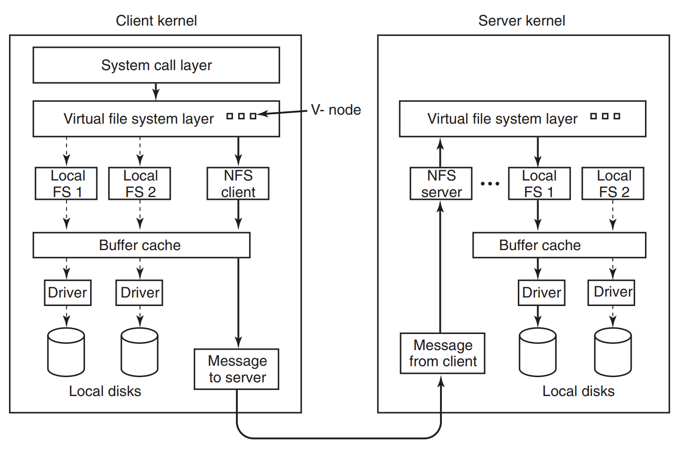

**System call layer** is a place where the whole interaction begin - it takes user commands (like *read*) and 
carries is further. **Virtual FS layer**, uses **v-nodes** (*virtual-inodes*), that store information about the 
resources (mostly if it is local or remote), and based on that data, uses appropriate driver. In result, a 
**r-node** (*remote i-node*) is associated with the **v-node* (for **NFS**) or 'normal' *i-node* (for local calls). 
For every next call to the external system, already existing **r-node** is used. In order to fully use the time that 
was spend on establishing the connection, data is being sent in larger chunks (usually *8kB*), to improve the 
overall performance. There's also a *cache* involved, however due to the remote nature of cached data, it is harder 
to implement than the usual one (for local storage). Timers are mostly used to keep the data in sync with the 
original source.

The **NFS** version described above, is actual *version 3* of it. However, there's a newer version, that actually is 
**stateful**, and therefore forces the server to keep information about all the files/folders that are accessed 
through **NFS**. It makes it easier for the clients, as no separate protocols must be used for 
mounting/reading/caching/etc. 


### Security in Linux

I assume everyone is aware of the *UID* and *GID* in Linux, especially that they're the basis of security there. 
Every process that is run, has an owner *UID* and *GUID*, the same goes to the files. The usual *rwx* access rights 
for files are the best example of importance of these concepts. Of course **superuser** with *UID 0* can access 
anything everywhere. 

As it was mentioned before - almost every device in Linux is presented as a file. Therefore, it would be pretty easy 
to limit access to the specific hardware for the users, although the hardware in general is there to be used by the 
users (eg. printers). To handle the problem a concept of **SETUID bit** was introduced, which is enables the user to 
access the device/run process with the access rights of its owner. 

Here are the system calls that are related to the system security.

| System call                                  | Description                                  |
|----------------------------------------------|----------------------------------------------|
| s = chmod(path, mode)                        | Change a file’s protection mode
| s = access(path, mode)                       | Check access using the real UID and GID
| uid = getuid()                               | Get the real UID
| gid = getgid()                               | Get the effective UID
| gid = getegid()                              | Get the real GID
| s = chown(path, owner, group)                | Change owner and group
| s = setuid(uid)                              | Set the UID
| s = setgid(gid)                              | Set the GID


### Android

To start with - the book was released in *2014*. Android since then came a long way, and today it's possible that 
things presented here are quite out-of-date, as this system development is way faster than eg. Linux (due to its age 
and increasing demand for functionalities on new phones). Second thing - as with Linux I won't be 
describing the history of a system or design goals. I'll jump right to the essentials.

#### Android architecture

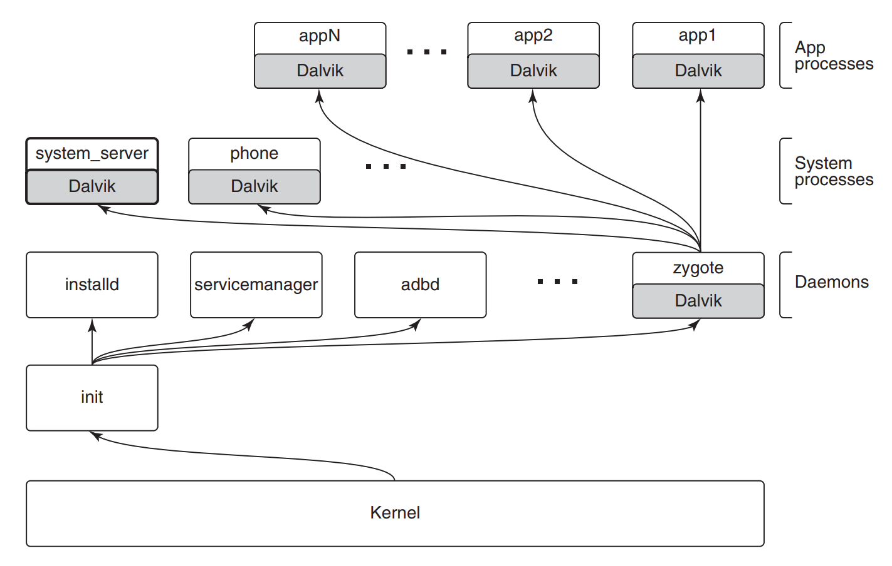


Similar to Linux the first process starting is *init*, which start the whole thing. What is important here - part of 
Android is written in Java, and therefore daemons that simulate it are used (in the picture above is *Dalvik*, 
although even that I don't follow the Android internals, I know that *Dalvik* was substituted with *ART* - *Android 
runtime*). 

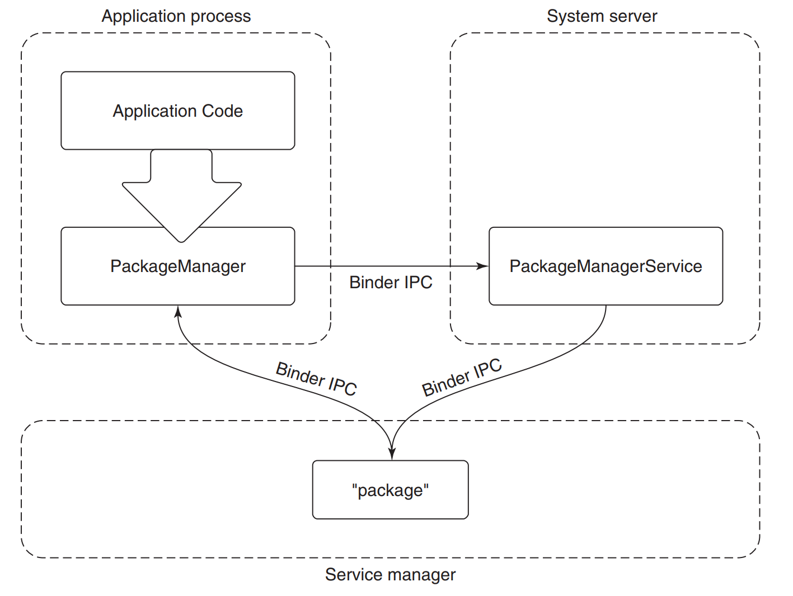

> [Picture] shows the typical design for Android framework APIs that interact with system services, in this case the 
> *package manager*. The package manager provides a framework API for applications to call in their local process, 
> here the PackageManager class. Internally, this class must get a connection to the corresponding service in the 
> *system_server*. To accomplish this, at boot time the *system_server* publishes each service under a well-defined 
> name  in the *service manager*, a daemon started by *init*. The *PackageManager* in the application process
retrieves a connection from the *service manager* to its system service using that same name.
Once the *PackageManager* has connected with its system service, it can make
calls on it. Most application calls to *PackageManager* are implemented as
interprocess communication using Android’s *Binder IPC* mechanism, in this case
making calls to the *PackageManagerService* implementation in the system server.
The implementation of *PackageManagerService* arbitrates interactions across all
client applications and maintains state that will be needed by multiple applications.


#### Linux extensions

Due to the nature of Android hardware (mobile phones mostly), there are several extensions to the Linux, that must 
have been introduced. One of them is **wake lock**, which is a power-saving/sleeping mechanism. Usually, Android is 
working in bursts - we put the phone aside and do something else. Suddenly, a message comes, or push notification 
from the app appears and so. We take the phone, do something and then put the phone aside again (with a screen turned 
off). However, that consumes energy and in mobile phones that is not that much of desired state. The solution used 
in Android is that the default state for the OS is *being asleep* (thus saving a lot of energy). In order for 
applications to do their work (handling the push notifications or incoming calls), there are *hardware interrupts* 
that take the system out of sleeping state. To keep the system that way a **wake lock** must be acquired and held, 
as long as there's any job to do.

Second one is **out-of-memory killer**, which is a part of Linux but seldom used, as it is a prevention mechanism, 
that allows the system to free the memory to operate. With all the caches, swapping and such it's hard to see it in 
action on the modern computers, however with mobile phones it's different. We often use *a lot* of applications, 
usually the stay in a background, and we can even not be aware of them eating our RAM. What is more - Android does 
not have *swap space*, so that makes it even harder. 

> Android introduces its own out-of-memory killer to the kernel,
with different semantics and design goals. The Android out-of-memory killer runs
much more aggressively: whenever RAM is getting 'low', low RAM is identified
by a tunable parameter indicating how much available free and cached RAM in the
kernel is acceptable. When the system goes below that limit, the out-of-memory
killer runs to release RAM from elsewhere. The goal is to ensure that the system
never gets into bad paging states, which can negatively impact the user experience
when foreground applications are competing for RAM, since their execution becomes much slower due to continual 
> paging in and out.


#### Dalvik

As I've written above *Dalvik* was replaced with **ART**, so I'm skipping this subchapter, and I recommend reading a 
<a href="https://en.wikipedia.org/wiki/Android_Runtime">related article on the Wiki</a>.


#### Binder IPC

On the typical mobile phone, there are lots of processes running, and the way they communicate is handled by the 
**Binder IPC**, which overall layered architecture is presented below.

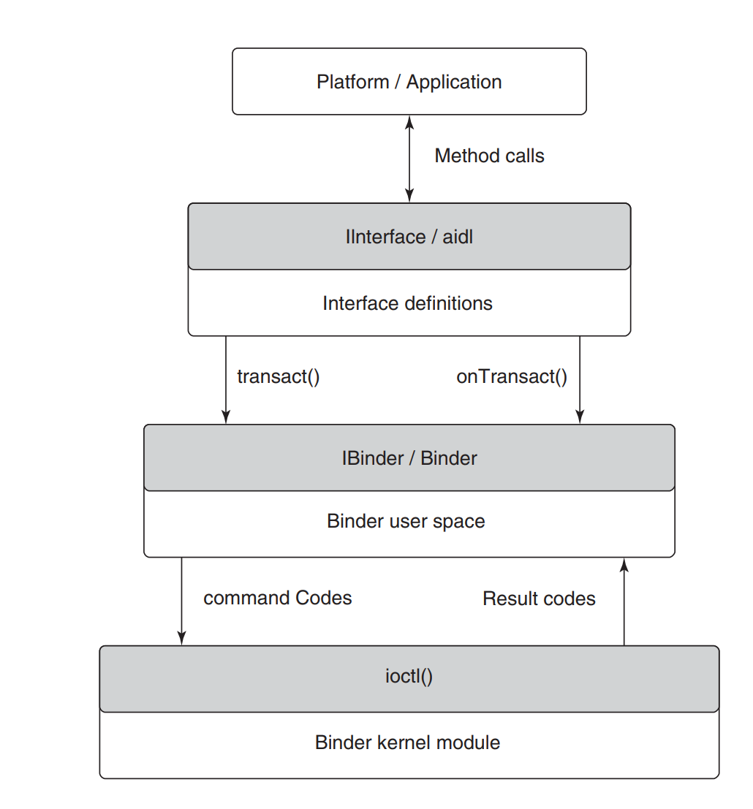


At the bottom there's a *kernel module*, which actually differs significantly from its Linux colleague. Due to the 
nature of hardware Android has its own IPC implementation based on **RPC**. The calling process passes the control 
to the kernel completely, sending a **transaction** with all the data necessary for the other process to do its job. 
Upon retrieval of **transaction** kernel copies it, adds sender identity to it and sends it to the target. The whole 
process is shown below.

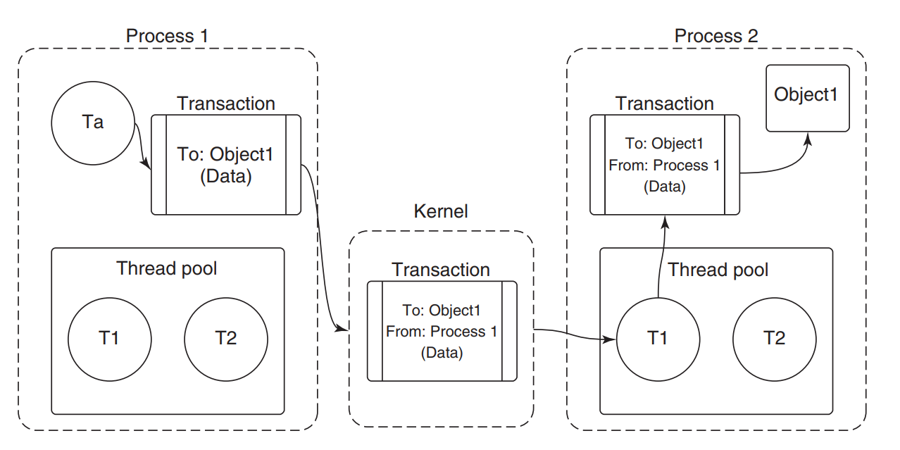

As You can see a **transaction** is targeting specific **object** (not a process itself). Therefore, a kernel must 
keep track of all the objects in the processes. As the **object** here is represented as an address in the target 
process memory space. References to other objects are identified as integers called **handles**. The whole job of 
assigning handles/keeping track of objects/etc is done by the kernel.  

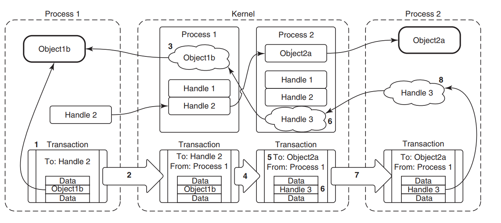

> 1. Process 1 creates the initial transaction structure, which contains the local address *Object1b*.
> 2. Process 1 submits the transaction to the kernel.
> 3. The kernel looks at the data in the transaction, finds the address *Object1b*, and creates a new entry for it 
   since it did not previously know about this address.
> 4. The kernel uses the target of the transaction, *Handle 2*, to determine that this is intended for *Object2a* which 
   is in *Process 2*.
> 5. The kernel now rewrites the transaction header to be appropriate for *Process 2*, changing its target to address 
   *Object2a*.
> 6. The kernel likewise rewrites the transaction data for the target process; here it finds that *Object1b* is not yet 
   known by *Process 2*, so a new *Handle 3* is created for it.
> 7. The rewritten transaction is delivered to *Process 2* for execution.
> 8. Upon receiving the transaction, the process discovers there is a new *Handle 3* and adds this to its table of 
   available handles.

Here in the book were very detailed description of actual *classes* being used to access *Binder* from the user 
space, however that's so implementation related topic that I've decided to just skip it. 


#### Android applications

Applications for Android are packed in a type of JAR file with *.apk* extension. This bundle contains all the 
resources, configs and code that the application uses. The most important file there is a **manifest file**, that 
holds all the necessary information about the app, and what is most important - it exposes its possibilities to the 
other apps or system. There are four types of components, that Android app can expose -  *activity, receiver, service, and content
provider*. In the book they're described in a very detailed way (again, with single classes being used), so I would 
skip that as it does not serve much purpose to identify so low-level implementation details. What must be said here 
is that it is **package manager** job, to track all the apps that are installed in the system, and **activity 
manager** (which runs on top of **package manager**) decides which applications should be run and when.


#### Application sandboxes and security

In general in Android when a new application is installed, a new user is created and every time the application run, 
this user is used as an owner. It sandboxes every application then, making it more secure to run apps even from 
untrusted sources. However, there's a limiting amount of *UIDs* that can be assigned to the installed apps (the 
books says it's *10k* of apps). Every application gets its part of the storage, where all the data it uses lies. The 
application itself cannot access the data of the other app. Of course, it's not impossible, how would eg. music 
playing apps access the data on the device, if they're imported by any other app? What about the pictures? In order to 
make it possible, there's an *installd* daemon in the works, and a concept of **application permissions** is used. 
Every time the application is installed, it requests permissions to access several functionalities of the system. An 
example is presented below.


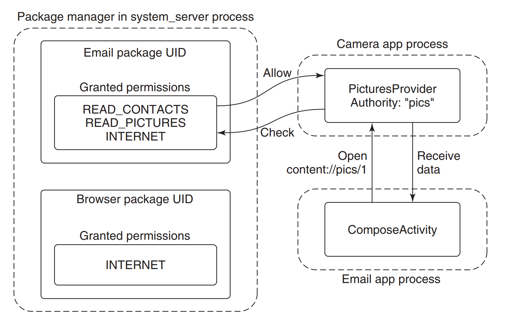


#### Process model

We remember how Linux handles processes - first we fork the current one then execute the job to be done. With 
Android, it is different - **activity manager** handles the job. The base here is called *zygote*. Every time the 
**activity manager** wants to start something, it creates *zygote*  (which is a dedicated socket), that runs with 
the *root* rights.  It creates the sandbox for the process to be run, and when everything is set, it switches to the 
*UID* the process is supposed to run with. The picture presents it, and below there's a direct quote from the book 
describing it.


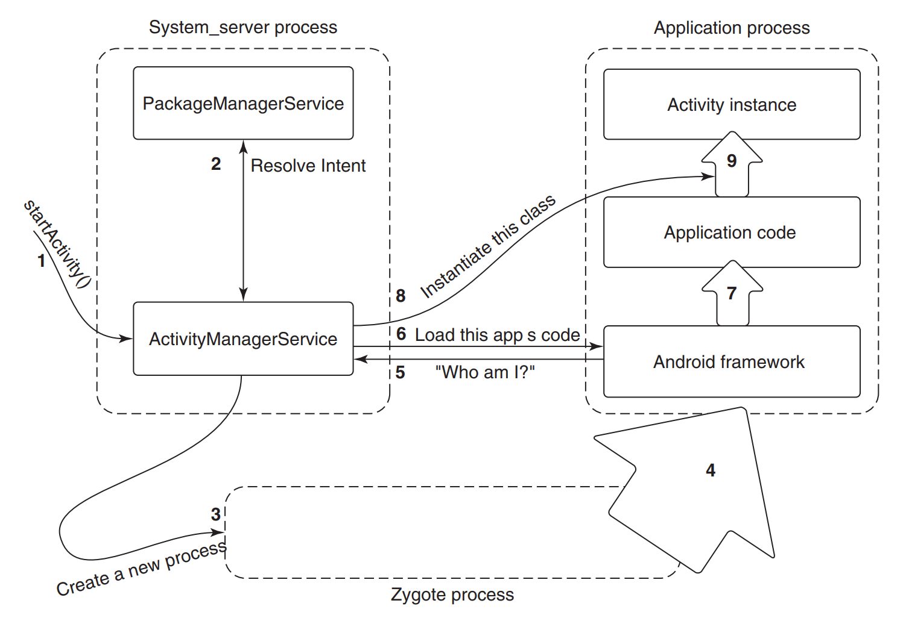


> 1. Some existing process (such as the app launcher) calls in to the activity manager with an intent describing the 
     > new activity it would like to  have started.
> 2. Activity manager asks the package manager to resolve the intent to an explicit component.
> 3. Activity manager determines that the application’s process is not already running, and then asks zygote for a 
   new process of the appropriate UID.
> 4. Zygote performs a fork, creating a new process that is a clone of itself,
   drops privileges and sets its UID appropriately for the application’s
   sandbox, and finishes initialization of Dalvik in that process so that
   the Java runtime is fully executing. For example, it must start threads
   like the garbage collector after it forks.
> 5. The new process, now a clone of zygote with the Java environment fully up and running, calls back to the 
    > activity manager, asking 'What am I supposed to do?'
> 6. Activity manager returns back the full information about the application it is starting, such as where to find 
    > its code.
> 7. New process loads the code for the application being run.
> 8. Activity manager sends to the new process any pending operations, in
     this case 'start activity X.'
> 9. New process receives the command to start an activity, instantiates the
   appropriate Java class, and executes it.


Do You remember *out-of-memory killer*? In order to know which process can be safely removed, **activity manager** 
uses **oom_adj** to indicate how 'serious' the process is. Here's the table showing the values for usual process types.


| Category           | Description                                  |   oom_adj
|--------------------|----------------------------------------------|-------------|
| SYSTEM             | The system and daemon processes              |    -16
| PERSISTENT         | Always-running application processes         |    -12
| FOREGROUND         | Currently interacting with user              |     0
| VISIBLE            | Visible to user                              |     1
| PERCEPTIBLE        | Something the user is aware of               |     2
| SERVICE            | Running background services                  |     3
| HOME               | The home/launcher process                    |     4
| CACHED             | Processes not in use                         |     5


So when the memory is getting low, **killer** starts with *CACHED* level and goes up. Within the level a process 
with the biggest memory footprint will be removed first. What is more - *oom_ajd* is influenced also by the other 
processes. Imagine a situation when email app requires access to the photos, in order to attach it to the email. 
In such case, the photo-related process will be promoted to the same level in which email app just resides. After 
the interaction, it goes back to the previous state. 
