## Chapter 11 - Windows 8

### The history of Windows

As this is history chapter I've decided to skip - otherwise I would have to rewrite the whole subchapter. If You're 
interested in the history there's a lot of material out there.

### Programming Windows

Below is a picture that shows the layered structure of Windows.

The main *entry point* (if You cna call it that) is **NTOS**, which is a kernel-mode program that provides 
system-calls that are available to all the applications that are running in user mode. Communication with it was 
done by using **personalities**, which included *OS/2* and *POSIX*, but that was changed and since Windows 8 only 
native, **Win32 personality** is available. **Personalities** are implemented using **subsystems**, but that will be 
discussed in a moment. What is more, Windows 8 introduced new API - **WinRT**. It was due to 
the fact, that Microsoft was planning to use Windows as a core system for many devices - not only desktops but 
multiple notebooks/netbooks, phones, tablets and such. Old, *Win32 API*, just couldn't handle that kind of goal. 

Every time an application is run, it's executed in a sandboxed environment (similar to the one used in Android), 
which is called **AppContainer**. Every application is treated like belonging to separate user, and when it requires 
some of the system resources, it uses **broker process** to get them. **Subsystems** are divided into four parts, 
and can be seen in the below picture.

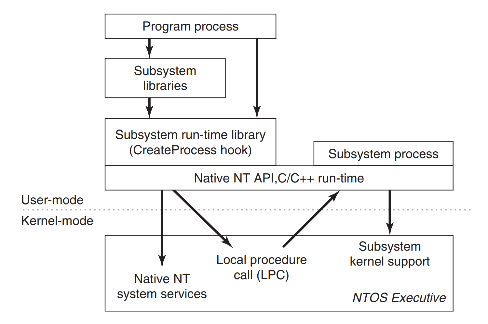

#### The native NT Application Programming Interface

These calls are the ones, that are exposed by the kernel. However, as Windows is not open sourced, and as the usage 
of these calls is restricted to the low-level operating system services, not a lot of info was published about them. 
Native NT API is used to create kernel-scoped *objects*, which upon creation/retrieval return a **handle** - which 
are very process specific (although, the can be duplicated and passed along). They have **security descriptor**, that 
guards what **object** can do and who/what can operate on it. **Kernel objects** are using **object manager**, which 
keeps track of all the objects and assigns them names within **NT namespace**, along with providing security, 
synchronization and such. 

#### The Win32 Application Programming Interface

All the functions in Windows are gathered in a *Win32 API*. I'm not familiar with Windows programming at all, 
although I'm aware of the existence of this API since forever (like 2007 when I started reading programming books). 
Especially in the context of its backwards compatibility - dating back Windows 95 ;) Of course *Win32 API* is using 
**native API** under the hood, and serves as a translator layer for it. Below You can find example *Win32 API* calls 
and their underlying collaborators from *native API*.
 

| Win32 call         | Native NT API call  |
|--------------------|---------------------|
| CreateProcess      | NtCreateProcess
| CreateThread       | NtCreateThread
| SuspendThread      | NtSuspendThread
| CreateSemaphore    | NtCreateSemaphore
| ReadFile           | NtReadFile
| DeleteFile         | NtSetInformationFile
| CreateFileMapping  | NtCreateSection
| VirtualAlloc       | NtAllocateVirtualMemory
| MapViewOfFile      | NtMapViewOfSection
| DuplicateHandle    | NtDuplicateObject
| CloseHandle        | NtClose

In order to make this backwards compatibility a working thing, there are two execution environments, that support 
that. Both are called **WOW (Windows on Windows)**, and are used to enable old *16bit* apps run on *32bit*, or 
*32bit* on *64bit*. There's more about this *API* in the book, but it concentrates on the specific calls in 
different areas, and I don't see it as that valuable input here, so I'm skipping it.

#### The Windows Registry

**Registry** is a special filesystem in the *NT namespace*, that is loaded and mounted every time a system starts. 
It holds configuration data for both the system and apps in it. It is organized in **hives**, which are stored in 
*C:\Windows\system32\config* folder. Before the **registry** was introduced, config files with *.ini* suffix were used. 
Below You can find basic **hives** and what they're used for.

| Hive file          | Mounted name          | Use
|--------------------|-----------------------|-------------------------------------------------|
| SYSTEM             | HKLM\SYSTEM           | OS configuration information, used by kernel
| HARDWARE           | HKLM\HARDWARE         | In-memory hive recording hardware detected
| BCD                | HKLM\BCD*             | Boot Configuration Database
| SAM                | HKLM\SAM              | Local user account information
| SECURITY           | HKLM\SECURITY         | Lsass’ account and other security information
| DEFAULT            | HKEY_USERS\.DEFAULT   | Default hive for new users
| NTUSER.DAT         | HKEY_USERS\<user id>  | User-specific hive, kept in home directory
| SOFTWARE           | HKLM\SOFTWARE         | Application classes registered by COM
| COMPONENTS         | HKLM\COMPONENTS       | Manifests and dependencies for sys. components

**Registry** grew complicated over the years, and it's quite hard to refactor and fix (that's what authors say). 
However, there are existing *Win32* calls to operate on it.

| Win32 API function          | Description
|-----------------------------|-----------------------
| RegCreateKeyEx              | Create a new registry key
| RegDeleteKey                | Delete a registry key
| RegOpenKeyEx                | Open a key to get a handle to it
| RegEnumKeyEx                | Enumerate the subkeys subordinate to the key of the handle
| RegQuery                    | ValueEx Look up the data for a value within a key

### System Structure

As Windows is closed-source system, there's not that much information about its internals out there. The recommended 
book about it at the time of writing is *Microsoft Windows Internals 6ed.* by **Russinovich and Salomon**.

#### Operating System Structure

> The central layer is the
NTOS kernel itself, which is loaded from *ntoskrnl.exe* when Windows boots.
NTOS itself consists of two layers, **the executive**, which containing most of the
services, and a smaller layer which is (also) called **the kernel** and implements the
underlying thread scheduling and synchronization abstractions (a kernel within the
kernel?), as well as implementing trap handlers, interrupts, and other aspects of
how the CPU is managed.

The structure described above comes from the predecessor of *Windows NT* family - *VAX/VMS* - which was an OS that 
ran on *VAX* CPUs and therefore had four hardware-enforced layers (user, supervisor, executive and kernel) with 
support from **protection rings** (remember them?). Below a whole stack is depicted.

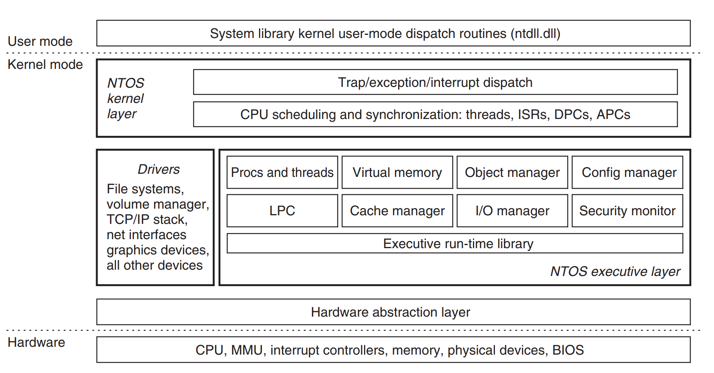

The upper-most layer is *ntdll.dll*, which is system library (can treat it similar to *libc* in Linux) and runs in
user-mode. It's crucial for programs to operate, therefore every process that starts in user-mode has this library
mapped into its memory at the predefined address. On the other end we have **HAL (Hardware Abstraction Layer)**,
that due to its name handles details of the hardware (like registers and *DMA*), and provides abstraction of it to
the higher layers. It serves as a barrier, that prevents upper layers-objects (eg. drivers) to deal with the most
low-level stuff, which makes adjustment of Windows to new CPU architectures/chipsets/etc a lot easier. All the jobs
that **HAL** does are depicted below.

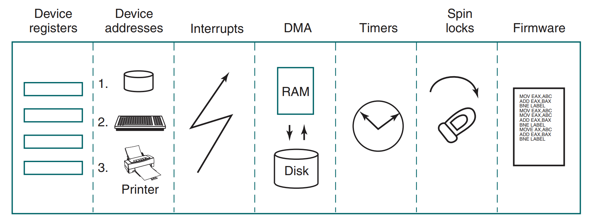

The layers that is not presented on the subsystem picture above is **Hyper-V**, which is available only in specific 
versions of Windows (or as standalone product that can be installed). As its name suggests, it handles 
virtualization in the Windows system, and is mostly used to host different versions of Windows (with a small 
addition of specific Linux versions).

Above **HAL** we got *NTOS*, with two layers that are crucial for the OS itself - **kernel layer** and **executive 
layer**. As the authors say, *kernel* is a confusing concept in Windows.

> It can refer to all the code that runs in the processor’s kernel mode. It can also refer to the *ntoskrnl.exe* file 
> which contains NTOS, the core of the Windows operating system. Or it can refer to the kernel layer within NTOS, 
> which is how we use it in this section. It is even used to name the user-mode Win32 library that provides the
> wrappers for the native system calls: *kernel32.dll*

The main goal of the **kernel layer** is to provide the abstractions for handling CPU (like threads). What is more, 
it provides low-level support for two types of objects that will be described now - **control objects** and 
**dispatcher objects**. 

**Control objects** is a group of objects that represent threads, interrupts, timers and such other, low-level 
concepts. There are two more that deserves an explanation. First is **DPC (Deferred Procedure Call)** which is an 
object used to decrease the time spend processing **ISR (Interrupt Service Routine)** (which is a Windows name for 
 interrupt handler). In short - **ISR** should perform the necessary, critical job that is related with handling an 
interrupt, but no more. They're ran with the priority of **3**. After the critical part is done, it's creating 
**DPC** to represent the rest of the job to be done. **DPC** is run with lower priority than **ISR** (level **2**), 
and is added to the **DPC queue** (every CPU has a separate one). When all the currently running **ISRs** are done,
CPU priority is lowered and **DPCs** can be processed. It reduces the chance that due to longer processing in one 
**ISR** other interrupts might be lost. Here's an example with a quote:

> [In Unix] The ISR would deal with fetching
characters from the hardware and queuing them. After all higher-level interrupt
processing was completed, a software interrupt would run a low-priority ISR to do
character processing, such as implementing backspace by sending control characters to the terminal to erase the last character displayed and move the cursor backward.
> 
> A similar example in Windows today is the keyboard device. After a key is
struck, the keyboard ISR reads the key code from a register and then reenables the
keyboard interrupt but does not do further processing of the key immediately. Instead, it uses a DPC to queue the processing of the key code until all outstanding
device interrupts have been processed.

The second type of **control object** that is described in more detail is **APC (Asynchronous Procedure Call)**. 
It's actually related to the **DPC**. In short, **DPCs** are running in the context of the thread that was active 
when the CPU started processing **DPCs**. Their job is just to finish processing the interrupt and preparing 
data/buffer/whatever to be processed by the thread that actually is waiting for a result of this processing. In the 
example with the keyboard, **DPC** stores data which key was pressed in a kernel memory/buffer, and schedules an 
**APC**. This **APC** is put in a queue assigned to the thread that is waiting for this keyboard pressed event. When 
all the **DPCs** are processed, CPU starts to run all the threads again and when it reaches the thread that has any 
**APCs** in a queue, it starts with processing them until the queue is empty.

The second type of **control object** that are important in *kernel layer* are **dispatcher objects**. Quote, and a 
picture here will say enough.

> This is any
ordinary kernel-mode object (the kind that users can refer to with handles) that
contains a data structure called a dispatcher header, shown below. These
objects include semaphores, mutexes, events, waitable timers, and other objects
that threads can wait on to synchronize execution with other threads. They also include objects representing open files, processes, threads, and IPC ports. The dispatcher data structure contains a flag representing the signaled state of the object,
and a queue of threads waiting for the object to be signaled

Second layer that is a part of Windows kernel-space in general is **executive layer**. It's mostly platform 
independent (with memory manager being an exception). Most of the components in it is called **manager**, as it 
takes care of a specific part of the system (eg. memory, processes, etc.). Functions within the components are 
usually run in the context of the thread that caused them to be called. For internal, kernel-cleaning tasks a pool 
of separate threads is created. In general, **control objects** in the kernel are managed by **object manager**, 
which is a separate component in **executive layer**. **I/O manager** as the name suggests, provides a framework for 
I/O device drivers. What is worth mentioning - the trend in Windows is to move **device drivers** (they'll be 
described soon) from the kernel to the user-space. Therefore, a bug in them does not cause the whole system to crash.
The rest of the components presented in the layer picture is pretty self-explanatory, and as the authors do not 
provide much technical details about them we're done here.

**Device drivers** are dynamically loaded libraries. Usually *driver* is linked with the hardware. In Windows that's 
obviously true too, although, *drivers* in general are used to extend the kernel functionality. To understand how 
the actual device is handled a quote is needed:

> The I/O manager organizes a data flow path for each instance of a device, as
shown in [the following picture]. This path is called a device stack and consists of private
instances of kernel device objects allocated for the path. Each device object in the
device stack is linked to a particular driver object, which contains the table of routines to use for the I/O request packets that flow through the device stack. In
some cases the devices in the stack represent drivers whose sole purpose is to filter
I/O operations aimed at a particular device, bus, or network driver. Filtering is
used for a number of reasons. Sometimes preprocessing or postprocessing I/O operations results in a cleaner architecture, while other times it is just pragmatic because the sources or rights to modify a driver are not available and so filtering is
used to work around the inability to modify those drivers.

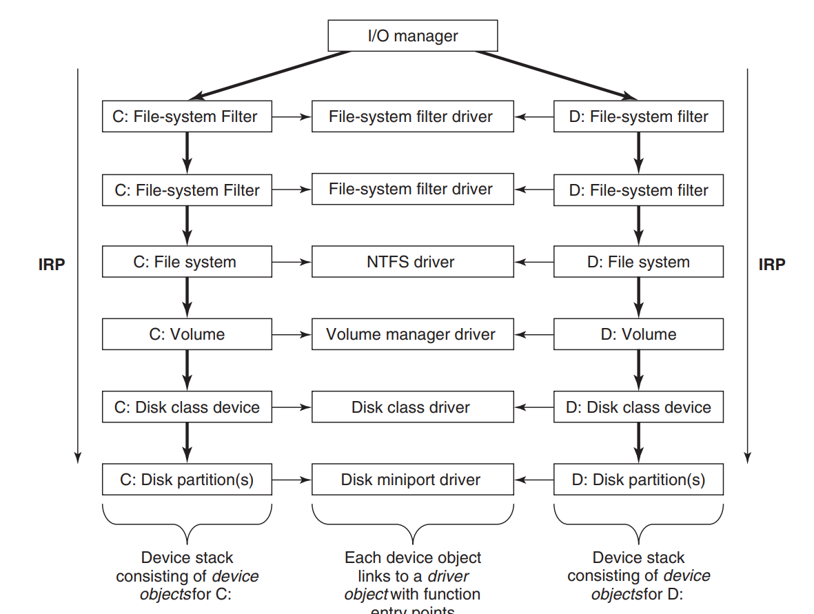

**File systems** are also loaded as **device drivers** (each instance of a volume has a corresponding **device 
object**). The whole *TCP/IP* stack is also loaded as a driver.

#### Booting Windows

We've discussed booting before (BIOS/UEFI), loading of **bootstrap program** from the first partition and such. In 
Windows, **bootstrap** knows only how and where to find *BootMgr* program, that will take the job from him. 
Depending on the state from which the system is booted (can be cold start, can be wake-up call from hibernation), a 
different program is later executed - *WinResume.exe* or *WinLoad.exe*. 

> *WinLoad* loads the boot components of the system into
memory: the kernel/executive (normally *ntoskrnl.exe*), the HAL (*hal.dll*), the file
containing the SYSTEM hive, the *Win32k.sys* driver containing the kernel-mode
parts of the Win32 subsystem, as well as images of any other drivers that are listed
in the SYSTEM hive as boot drivers—meaning they are needed when the system
first boots. If the system has Hyper-V enabled, WinLoad also loads and starts the
hypervisor program.
Once the Windows boot components have been loaded into memory, control is
handed over to the low-level code in NTOS which proceeds to initialize the HAL, kernel, and executive layers, link in
> the driver images, and access/update configuration data in the SYSTEM hive. After all the kernel-mode components are
> initialized, the first user-mode process is created using for running the smss.exe program (which is like 
> */etc/init* in UNIX systems).

#### Implementation of the object manager

**Object manager** is crucial for orchestrating the inner workings of Windows kernel. It creates and manages all the 
objects and data structures used during system run (files, threads, processes and such). All these objects are 
created and managed in the same way, and are accessible from the user-space through *handlers*. They are uniquely 
named within the NT-namespace. With every reboot (or crash), they're recreated from scratch. The structure of these 
objects is presented below:

The memory needed for these objects comes from one of two pools/heaps that reside in the **executive layer**. 
They can be used to allocate **pageable** or **nonpageable** memory. The **nonpageable** is 
specifically designed to be used by the objects that are used by the **priority level 2** (**DPCs, ISRs** and 
 thread scheduler). *Page-fault handler* also have its data structure allocated that way to avoid recursion. In the 
picture there's also a **quota** presented, which is used for every object to indicate how 'fat' the object is. 
Quotas are summed per user, to make sure that one single user does not drain all the system's resources. As the 
physical and virtual memory are always in demand, it's crucial for unused objects to be release, and their addresses 
and memory returned to the pool. That sometimes can be interfered (as there's a lot of async operations happening 
in the **executive layer**), which can leave the object in inconsistent state. 

> To avoid freeing objects prematurely due to race conditions, the object manager implements a reference counting
> mechanism and the concept of a **referenced pointer**. A referenced pointer is needed to access an object whenever 
> that object is in danger of being deleted. Depending on the conventions regarding each particular object type, 
> there are only certain times when an object might be deleted by another thread. At other times the use of locks,
> dependencies between data structures, and even the fact that no other thread has a pointer to an object are sufficient
to keep the object from being prematurely deleted.

**Handles** are, well, handles ;) that can be used by user-space objects to get access to the kernel-mode objects. 
**Object manager** is responsible for taking a **handle**, and then translating it to the kernel-space object. A 
**handle-table** is used to do the mapping (every process has its own separate one), which when needed, can be 
extended with layers of indirection. The whole idea is presented below:

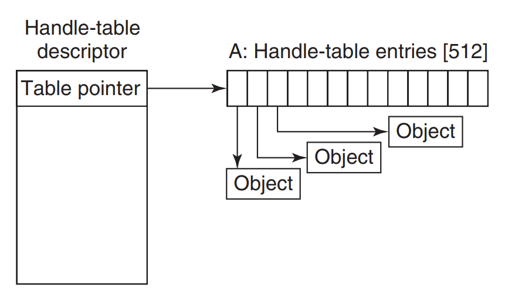

As authors are stating, it's sometimes useful even for kernel-space code, to use **handles** instead of **direct 
pointers**. To achieve that there are separate **kernel handles** present. They're encoded and not accessible from 
the user-space. For the user-space process to get access to the **handler** a call must be made using *Win32 API*. 
What is returned is the *32bit index* of the entry in the process **handle table** to be used later when necessary.

It was mentioned before, that every **control object** has a unique name within NT namespace. In general, **object 
manager** can give any arbitrary object a name within NT namespace. What is more, in the hierarchical structure 
which namespace is (with directories and symbolic links), any kind of object can add its own extensions, as long as 
they specify a **routine**. The **routines** are assigned to the object once it's created, and are listed below.

| Procedure         |  When called                                | Notes
|-------------------|---------------------------------------------|-----------------------
| Open              | For every new handle                        | Rarely used
| Parse             | For object types that extend the namespace  | Used for files and registry keys
| Close             | At last handle close                        | Clean up visible side effects
| Delete            | At last pointer dereference                 | Object is about to be deleted
| Security          | Get or set object’s security descriptor     | Protection
| QueryName         | Get object’s name                           | Rarely used outside kernel

Authors claim, that the whole concept of a **namespace** is not that widely known, as it's transparent, and to 
actually take a look at it, some special tools are needed (one of them being: *winobj*). A usual dump from this tool 
looks something like this:

| Directory         |  Contents
|-------------------|---------------------------------------------
| \??               | Starting place for looking up MS-DOS devices like C:                  
| \DosDevices       | Official name of \ ??, but really just a symbolic link to \ ??                      
| \Device           | All discovered I/O devices                   
| \Driver           | Objects corresponding to each loaded device driver               
| \ObjectTypes      | The type objects (will be mentioned later)            
| \Windows          | Objects for sending messages to all the Win32 GUI windows              
| \BaseNamedObjects | User-created Win32 objects such as semaphores, mutexes, etc.                 
| \Arcname          | Partition names discovered by the boot loader                  
| \NLS              | National Language Support objects                  
| \FileSystem       | File-system driver objects and file system recognizer objects                 
| \Security         | Objects belonging to the security system                       
| \KnownDLLs        | Key shared libraries that are opened early and held open

Every object has a separate **handle count** kept by the **object manager** - that is because specific object types 
may need some operations to be performed when the last handle is released (eg. files). Unfortunately, there's no 
standardized way for keeping handles from being closed/reused among multithreaded applications. There's a special 
application called **application verifier**, that can check for such problems.

A separate (and last one) type of **control objects** are **device objects** which are linked with **drivers**. They 
represent not only the hardware as You may expect - they can represent a lot more (partitions or file systems are 
examples of that). Here I will just quote the book to present *Parse* procedure being used.

> 1. When an executive component, such as the I/O manager implementing the native system call NtCreateFile, calls 
> *ObOpenObjectByName* in the object manager, it passes a Unicode path name for the NT namespace, say \??\C:\foo\bar
> 2. The object manager searches through directories and symbolic links
     and ultimately finds that \ ?? \ C: refers to a device object (a type defined by the I/O manager). The device object is a leaf node in the part
     of the NT namespace that the object manager manages.
> 3. The object manager then calls the Parse procedure for this object
   type, which happens to be IopParseDevice implemented by the I/O
   manager. It passes not only a pointer to the device object it found (for
   C:), but also the remaining string \foo\bar.
> 4. The I/O manager will create an IRP (I/O Request Packet), allocate a
   file object, and send the request to the stack of I/O devices determined
   by the device object found by the object manager.
> 5. The IRP is passed down the I/O stack until it reaches a device object
   representing the file-system instance for C:. At each stage, control is
   passed to an entry point into the driver object associated with the device object at that level. The entry point used here is for CREATE
   operations, since the request is to create or open a file named
   \foo\bar on the volume.
> 6. The device objects encountered as the IRP heads toward the file system represent file-system filter drivers, which may modify the I/O operation before it reaches the file-system device object. Typically
     these intermediate devices represent system extensions like antivirus
     filters.
> 7. The file-system device object has a link to the file-system driver object, say NTFS. So, the driver object 
    > contains the address of the CREATE operation within NTFS.
> 8. NTFS will fill in the file object and return it to the I/O manager,
   which returns back up through all the devices on the stack until *IopParseDevice* returns to the object manager.
> 9. The object manager is finished with its namespace lookup. It received back an initialized object from the Parse 
    > routine (which happens to be a file object—not the original device object it found). So
   the object manager creates a handle for the file object in the handle
   table of the current process, and returns the handle to its caller.
> 10. The final step is to return back to the user-mode caller, which in this example is the Win32 API CreateFile, 
> which will return the handle to the application.

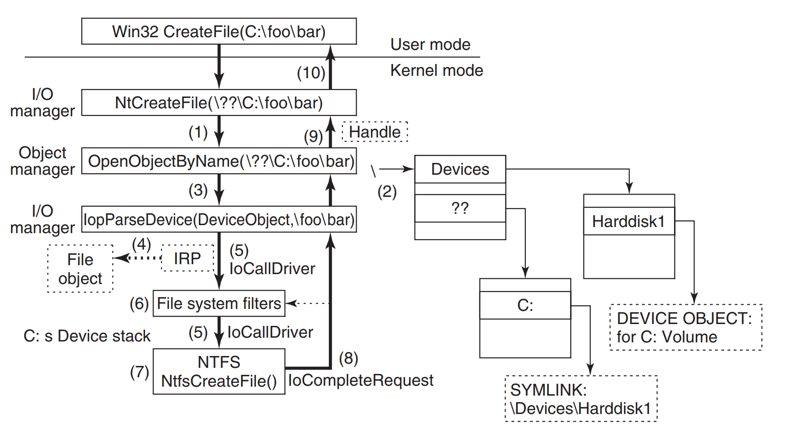

To end the subchapter - here's the list of the most popular **control objects** with a short description. The list 
is not definite, and can vary between versions.

| Type                |  Description
|---------------------|---------------------------------------------
| Process             | User process
| Thread              | Thread within a process
| Semaphore           | Counting semaphore used for interprocess synchronization
| Mutex               | Binary semaphore used to enter a critical region
| Event               | Synchronization object with persistent state (signaled/not)
| ALPC port           | Mechanism for interprocess message passing
| Timer               | Object allowing a thread to sleep for a fixed time interval
| Queue               | Object used for completion notification on asynchronous I/O
| Open file           | Object associated with an open file
| Access token        | Security descriptor for some object
| Profile             | Data structure used for profiling CPU usage
| Section             | Object used for representing mappable files
| Key                 | Registry key, used to attach registry to object-manager namespace
| Object directory    | Directory for grouping objects within the object manager
| Symbolic link       | Refers to another object manager object by path name
| Device              | I/O device object for a physical device, bus, driver, or volume instance
| Device driver       | Each loaded device driver has its own object

#### Subsystems, DLLs, and User-Mode Services

The last subchapter is dedicated to the *user space*, and especially to three components - **environment subsystems, 
DLLs** and **service processes**. The first one - **environment subsystems** were discussed before - as a reminder - 
they were created as a *personalities*, that could act as other OSes at a time (for the user), but with common logic 
in the kernel. As *Win32 API* dominated the scene - it's not used anymore.

**DLLs** are a widely known concept of **dynamic libraries**, that are attached to the program during its runtime. 
Even the base library - *ntdll.dll* - are used in that way. Of course all well-known limitations of **dynamic 
libraries** are present here too (security concerns/versioning). When application starts, a graph of all the 
necessary **DLLs** is created and results in putting all the data in **IAT (Import Address Table)**. It's a next 
level of indirection, and a program when running calls routines that are put in this table, not the 'code directly'.
That construction enables to eg. be able to use two different versions of **DLLs** for example (this is called 
**side-by-side**), or to execute some logic before the whole library is used. 

At the end **services** are mentioned, but to sum it up - there's a lot of them, and Windows uses them extensively.

### Processes and threads in Windows

In Windows processes are containers for programs. Authors state that they hold objects like:
* pointer to quota structure
* shared token object
* default params for threads initialization

Each process also has **PEB (Process Environment Block)**, that holds list of loaded modules by the program (*EXEs* 
and *DLLs*), env variables, working directory and such. On the other hand, **threads** are an abstraction over CPU 
use. Each thread has a priority (assigned by the process), and they can also be affinitized, meaning putting their 
execution on the specific CPU (to support multicore chips). Threads have two separate stacks - one for user-mode and 
one for kernel-mode. Next structure to mention is **TEB (Thread Environment Block)**, which similar to **PEB** holds 
user-mode data related to the thread. To end things with data structures we have to mention **user shared data**, 
that kernel holds and can modify (user-space can only read). It was created to hold common data for processes in 
order to improve speed (eg. time, versions of components, available memory size).

**Processes** described in this part of the book resolve to the notion, that they're just containers for threads, 
which was already written above. More interesting concept is **job**, which is a group of processes gathered together 
to enforce some common behaviour for them (eg. resource usage guards) or just to indicate, that these processes are 
running within one application. An additional piece of the puzzle are **fibers**, which are execution units that are 
somehow 'smaller' than threads. A thread can be transformed to **fiber**, but it's also possible to create a 
**fiber** from scratch. They're mostly used to speed things up, as switching between **fibers** is faster than 
between threads. An important thing here is synchronization of data between them. Below picture presents the whole 
stack.

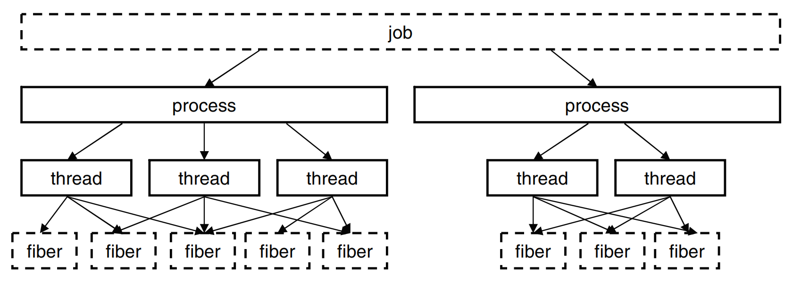

Creating **threads** is costly - maybe not that much as **processes**, but still there's some overhead. To make it 
more efficient, every program maintains a **thread pool**, which is being reused on and on for the tasks that 
program wants to execute (there's a proper *Win32 API* for that). Of course - **thread pool** is not perfect - 
there's a possibility that thread will block, and then it's not usable. Therefore, a usual solution is for a **thread 
pool** to be larger than the number of available CPUs. What is more - what we see as a thread, is actually two 
threads - one for user-mode and second for kernel-mode (they do not run at the same time). Therefore, there are two 
separate stacks for every type of thread.

Since Windows 7, there's something called **UMS (User-mode scheduling)**, that enables switching between threads. It 
actually contradicts whatever was said until now, so I'll use quote here to elaborate the three key concepts of it 
(**UMS** is mostly targeted for runtime libraries).

> 1. **User-mode switching**: a user-mode scheduler can be written to switch
between user threads without entering the kernel. When a user thread
does enter kernel mode, UMS will find the corresponding kernel
thread and immediately switch to it.
> 2. **Reentering the user-mode scheduler**: when the execution of a kernel
   thread blocks to await the availability of a resource, UMS switches to
   a special user thread and executes the user-mode scheduler so that a
   different user thread can be scheduled to run on the current processor.
   This allows the current process to continue using the current processor for its full turn rather than having to get in line behind other
   processes when one of its threads blocks.
> 3. **System-call completion**: after a blocked kernel thread eventually is
   finished, a notification containing the results of the system calls is
   queued for the user-mode scheduler so that it can switch to the corresponding user thread next time it makes a scheduling decision. 

**Threads** are started with the process - at the beginning there's only one thread in a process, but then 
additional ones can be created. ID of the thread comes from the same space as PID, so there's no way there's a 
collision in any way. OS always operates on the threads to be run, not the processes. These IDs are multiples of 
four, because they're actually allocated by the *executive component* using *handle table*. IDs returned to the pool 
(meaning threads/processes that finished their job) are not reused right away to avoid problems that will be 
discussed later. To conclude this - it was mentioned that there are two separate stacks for a thread, although, 
there are processes that run only in the kernel mode. OS provides for them a separate environment to be run in.

#### Job, Process, Thread, and Fiber Management API Calls

Method used in *Win32 API* for process creation is *CreateProcess* (thank You, Captain Obvious). It has a lot of 
parameters, and returns not only PID, but also a handler to the process/thread that actually created the new one. 
Differences between UNIX and Windows are summarized below.

> 1. The actual search path for finding the program to execute is buried in
     the library code for Win32, but managed more explicitly in UNIX.
> 2. The current working directory is a kernel-mode concept in UNIX but
   a user-mode string in Windows. Windows does open a handle on the
   current directory for each process, with the same annoying effect as in
   UNIX: you cannot delete the directory, unless it happens to be across
   the network, in which case you can delete it.
> 3. UNIX parses the command line and passes an array of parameters,
   while Win32 leaves argument parsing up to the individual program.
   As a consequence, different programs may handle wildcards (e.g.,
   *.txt) and other special symbols in an inconsistent way.
> 4. Whether file descriptors can be inherited in UNIX is a property of the
   handle. In Windows it is a property of both the handle and a parameter to process creation.
> 5. Win32 is GUI oriented, so new processes are directly passed information about their primary window, while this
   information is passed as parameters to GUI applications in UNIX.
> 6. Windows does not have a SETUID bit as a property of the executable,
   but one process can create a process that runs as a different user, as
   long as it can obtain a token with that user’s credentials.
> 7. The process and thread handle returned from Windows can be used at
   any time to modify the new process/thread in many substantive ways,
   including modifying the virtual memory, injecting threads into the
   process, and altering the execution of threads. UNIX makes modifications to the new process only between the fork and exec calls, and
   only in limited ways as exec throws out all the user-mode state of the
   process.

The actual NT calls for process/thread creation are way simpler than *Win32 API* call. Since Windows Vista, a new 
call was added in the native API - *NtCreateUserProcess*, that moved a lot of code from user-space to kernel-space. 
That was done in order to improve processes in regard to them being security boundaries - as the authors say - for 
digital rights management. 

Threads/processes should be able to communicate with each other. In Windows that can be achieved by **pipes** 
(*byte* or *message*), **named pipes**, **mailslots**, **sockets**, **remote procedure calls** and **shared files**. 
**Pipes** are not that much different than the ones from UNIX (**message pipes** are preserve messages boundaries). 
**Mailslots** are legacy from **OS/2** subsystem. **Sockets** are similar to **pipes**, the only difference being 
that they're used for intermachine communication. **RPC** is an abstraction layer over transport layer (TCP/IP 
sockets, named pipes or **ALPC**, which stands for **Advanced Local Procedure Call**). 

**Synchronization** between threads is done using **synchronization objects** - therefore, when one thread blocks, 
it does not affect other threads in the same process. **Semaphores** and **mutexes** are **kernel-mode objects** - 
I will skip detailed *Win32 API* calls for creating them that authors put in the book. **Critical sections** are a 
specific Windows **synchronization object**, that are similar to **mutexes**, although - they exist only in the 
scope of a single process, and cannot be shared between other ones. Due to the fact that they operate in userland, 
they're way faster than other **sync objects**. The last type of object to be described is **event** 
(which is kernel-mode object of two types - **notification event** and **synchronization event**). When the 
**event** is created, the behaviour of threads listening to this event depends on its type. For **notification 
events**,  all the awaiting threads are released. With **synchronized event**, only one of the threads is released 
and an event is cleared.

#### Implementation of processes and threads
 
Creation of processes and threads from API perspective is quite in detail described in the book. It starts with 
*Win32 API CreateProcess* method being called, than then passes the control to native *NtCreateUserProcess*. As this 
process involves a lot of steps, the only reasonable thing to do here would be to just quote it:

> 1. Convert the executable file name given as a parameter from a Win32 path name to an NT path name. If the executable has just a name
     without a directory path name, it is searched for in the directories listed in the default directories (which include, but are not limited to,
     those in the PATH variable in the environment).
> 2. Bundle up the process-creation parameters and pass them, along with the full path name of the executable program, to the native API *NtCreateUserProcess*.
> 3. Running in kernel mode, NtCreateUserProcess processes the parameters, then opens the program image and creates a 
    > section object that can be used to map the program into the new process’ virtual address space.
> 4. The process manager allocates and initializes the process object (the kernel data structure representing a process to both the kernel and executive layers).
> 5. The memory manager creates the address space for the new process by allocating and initializing the page directories and the virtual address descriptors which describe the kernel-mode portion, including
     the process-specific regions, such as the **self-map** page-directory entries that gives each process kernel-mode 
     > access to the physical pages in its entire page table using kernel virtual addresses.
> 6. A handle table is created for the new process, and all the handles from the caller that are allowed to be 
   inherited are duplicated into it.
> 7. The shared user page is mapped, and the memory manager initializes the working-set data structures used for deciding what pages to trim
   from a process when physical memory is low. The pieces of the executable image represented by the section object are mapped into the
   new process’ user-mode address space.
> 8. The executive creates and initializes the user-mode PEB, which is used by both user mode processes and the kernel to maintain processwide state information, such as the user-mode heap pointers and
   the list of loaded libraries (DLLs).
> 9. Virtual memory is allocated in the new process and used to pass parameters, including the environment strings 
    > and command line.
> 10. A process ID is allocated from the special handle table (ID table) the kernel maintains for efficiently allocating locally unique IDs for processes and threads.
> 11. A thread object is allocated and initialized. A user-mode stack is allocated along with the Thread Environment 
     > Block (TEB). The CONTEXT record which contains the thread’s initial values for the CPU
    registers (including the instruction and stack pointers) is initialized.
> 12. The process object is added to the global list of processes. Handles for the process and thread objects are allocated in the caller’s handle
    table. An ID for the initial thread is allocated from the ID table.
> 13. *NtCreateUserProcess* returns to user mode with the new process
    created, containing a single thread that is ready to run but suspended.
> 14. If the NT API fails, the Win32 code checks to see if this might be a process belonging to another subsystem like WOW64. Or perhaps
    the program is marked that it should be run under the debugger. These special cases are handled with special 
      > code in the user-mode
    CreateProcess code.
> 15. If NtCreateUserProcess was successful, there is still some work to be
      done. Win32 processes have to be registered with the Win32 subsystem process, csrss.exe. Kernel32.dll sends a message to csrss telling it
      about the new process along with the process and thread handles so it can duplicate itself. The process and threads are entered into the subsystems’ tables so that they have a complete list of all Win32 processes and threads. The subsystem then displays a cursor containing a pointer with an hourglass to tell the user that something is
      going on but that the cursor can be used in the meanwhile. When the process makes its first GUI call, usually to create a window, the cursor is removed (it times out after 2 seconds if no call is forthcoming).
> 16. If the process is restricted, such as low-rights Internet Explorer, the token is modified to restrict what objects the new process can access.
> 17. If the application program was marked as needing to be shimmed to run compatibly with the current version of Windows, the specified
    shims are applied. Shims usually wrap library calls to slightly modify their behavior, such as returning a fake version number or delaying
    the freeing of memory.
> 18. Finally, call NtResumeThread to unsuspend the thread, and return the structure to the caller containing the IDs and handles for the process
    and thread that were just created.

**Scheduling** in Windows is done differently than in UNIX - there's no central scheduling thread. Instead, when 
thread cannot proceed further - it calls the scheduler on its own. Depending on the reason for giving up the control 
(blocking, changing mutex or running out of quota), control can be passed differently. When blocked, a thread just 
gets next thread to pass the control to. In the case of changing mutex, a control returns to the thread (as calling 
mutex is never blocking), but **scheduler thread** must be called in order to check, if changing mutex caused 
thread with higher priority to be informed. If yes, the control is passed to it. That's not necessary on 
**multiprocessor machines**, as thread with higher priority can be transferred to the other CPU. When *quota* 
expires, a **scheduling thread** is called, but it can pass control back to the thread that called it. 
In such case a *quota* is reset to the full value, and a thread can carry on. **Scheduling thread** can be also called
when *I/O operation completes* or *timed wait expires*.

**Scheduling algorithm** itself operates using two different *Win32 API calls* - *SetPriorityClass* (set specific 
**priority class** to all the thread's in specific process) and 
*SetThreadPriority* (sets **thread priority** of specific thread). Based on the used combination of **PriorityClass** 
and **ThreadPriority** a number in the range *0..32* is set for the thread. The matrix below shows that.

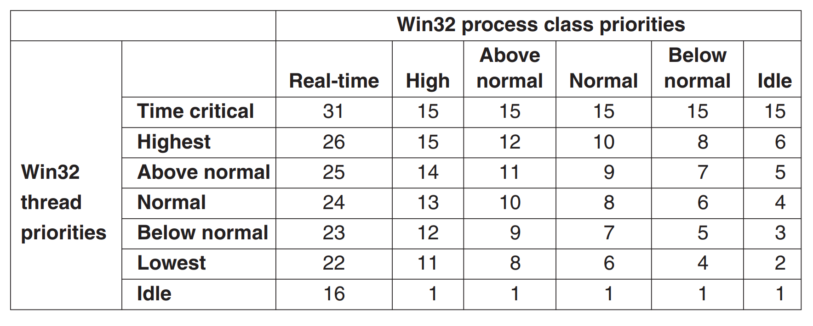

Scheduling is simple - OS has an array of *32* lists, that contains threads with specific priority. The lists 
contain only threads that are ready to run, not all of them! Every time there's an event that triggers search for 
next thread to run (described above), every list (starting from the one with the highest priority) is iterated over, 
and a thread is run for a specific *quota*. After that, it goes to the end of the list.

**User threads** cannot by default have **priority level** higher than *15*. That also applies to the situation when 
the **actual priority** (described below) is temporarily increased.

Every thread has its **base priority**, but there's also an **actual priority**, which can
be higher than the **base one**, although never lower! That is needed to speed up the schedulling. Let's assume that
a thread was blocked, but *I/O* that it was waiting for is not complete. In order to enable other threads to use
*I/O channel* that just stopped processing, temporarily a thread **priority** is risen, which allows it to finish
the processing, and making *I/O* fully available to the other threads. 

To finish this subchapter two things must be presented. First one is **priority inversion**, which is caused by a 
situation, in which thread with higher priority is waiting for eg. *semaphore*, that should be changed by a thread 
with lower priority (example given in a book is producer-consumer problem). Unfortunately, if there's a thread with a 
priority that is higher than the consumer, both - producer and consumer - are blocked. It's depicted below.

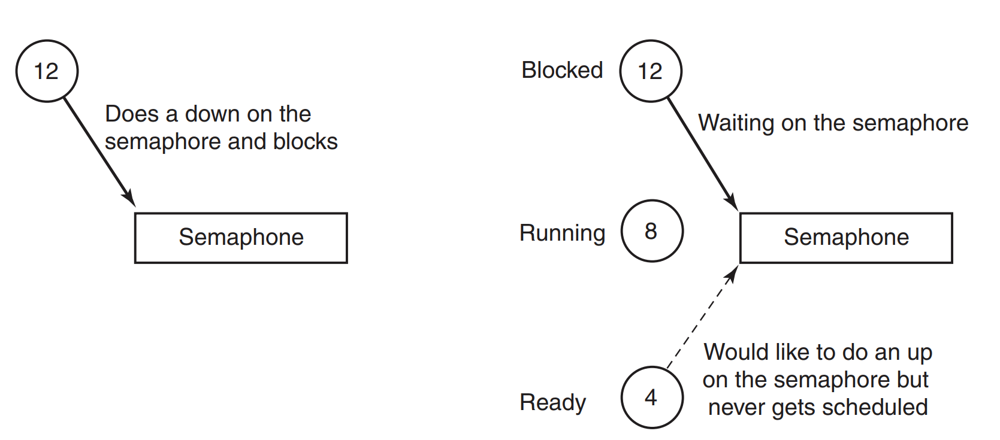

To prevent such situations from hapenning, there's a separate functionality in **thread scheduler** called 
**Autoboost**, that tracks the resource dependencies between threads and boosts the threads priority to avoid 
**inversion**. Second thing to mentioned is multi-user execution. Usually, Windows is used on desktops, where only 
one session/user is being active. However, it's possible to use **terminal server**, that enables multiple users to 
connect to the machine using **RDP**. To prevent exhausting all the machine resources by one user, there's a **DFSS 
(Dynamic Fair-Share Scheduling)** implemented, that groups the threads per user, and tries to balance resources 
usages between **scheduling groups**.

### Memory management

As the authors are writing, Windows has a very robust memory management system, and it's the largest component of 
the NTOS layer. Let's dig in.

#### Fundamental concepts

> In Windows, every user process has its own virtual address space. For x86 machines, virtual addresses are 32 bits long, so each process has 4 GB of virtual address space, with the user and kernel each receiving 2 GB. For x64 machines, both
the user and kernel receive more virtual addresses than they can reasonably use in
the foreseeable future. For both x86 and x64, the virtual address space is demand
paged, with a fixed page size of 4 KB—though in some cases, as we will see shortly, 2-MB large pages are also used (by using a page directory only and bypassing
the corresponding page table)

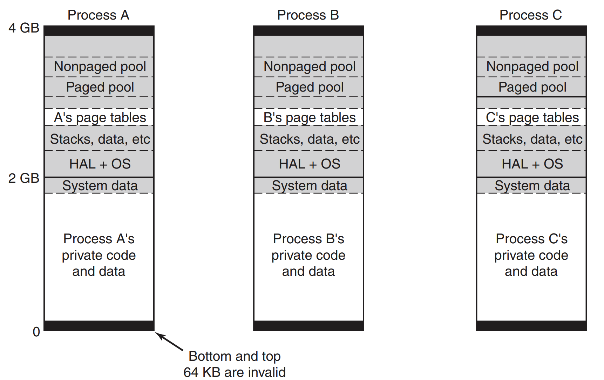

In the above picture a greyed areas are accessible only when in kernel-mode, and what is more - it's shared between 
all the processes. Each page of virtual address can be in one three states - **invalid**, **reserved** and 
**commited**. **Invalid state** is exactly what it is - **invalid**. It's not mapped to the memory section object 
and any attempt to access it will result in an access violation. **Commited state** on the other hand, is a state 
where there's an actual data associated with the address. **Reserved** is a state, in which page does not contain data (yet), but cannot be acquired by **memory manager**. 
They're mostly used to guard process stack from overflowing and overriding other processes data.

To back the storage of virtual pages, a **pagefile** is maintained, which is a OS way to increase the total amount 
of memory. As long as virtual memory is smaller than the physical memory, this file is not needed at all. However, 
when the usage of memory is increasing, the file appears. In order to minimalize *I/O* required, **commited pages** 
are not allocated a space in **pagefile**, as long as there's no need to write them out (it's called *just-in-time* 
strategy*).

What is more, in the situation when there's a need to store the pages to the file, it's not done for every page 
separately. To avoid excessive *I/O*, the pages are grouped in a big chunks, and stored in one big operation (quite 
often in a continuous way on the disk). After reading the page from the disk, it's being kept there until it's not 
modified. If the page is long in a memory, and it's not being modified, it's being moved to the **standby list**, 
which stores the pages that can be reused without storing back to the disk. When there's an attempt to modify such 
page, it will be deleted from the **pagefile** and kept only in memory until it's necessary to put it on the disk.

#### Memory-management system calls

*Win32 API* has several methods to manage virtual memory, usually operating on one page, or a couple of them placed 
in a continous manner in the virtual space. Here's the list.

| API function        |  Description
|---------------------|---------------------------------------------
| VirtualAlloc        | Reserve or commit a region
| VirtualFree         | Release or decommit a region
| VirtualProtect      | Change the read/write/execute protection on a region
| VirtualQuery        | Inquire about the status of a region
| VirtualLock         | Make a region memory resident (i.e., disable paging for it)
| VirtualUnlock       | Make a region pageable in the usual way
| CreateFileMapping   | Create a file-mapping object and (optionally) assign it a name
| MapViewOfFile       | Map (par t of) a file into the address space
| UnmapViewOfFile     | Remove a mapped file from the address space
| OpenFileMapping     | Open a previously created file-mapping object

#### Implementation of memory management

> Windows, on the x86, supports a single linear *4-GB* demand-paged address
space per process. Segmentation is not supported in any form. Theoretically, page
sizes can be any power of *2* up to *64 KB*. On the x86 they are normally fixed at 4
KB. In addition, the operating system can use 2-MB large pages to improve the effectiveness of the 
> **TLB (Translation Lookaside Buffer)** in the processor’s memory management unit. Use of *2-MB* large pages by the 
> kernel and large applications significantly improves performance by improving the hit rate for the **TLB** and
reducing the number of times the page tables have to be walked to find entries that
are missing from the **TLB**.

Unlike the scheduler, **memory manager** operates on the process-level, and does not care about threads. Every 
memory region that was allocated for the process, has its corresponding **VAD (Virtual Address Descriptor)** created,
which represents a virtual memory range. Corresponding **page table** and **page table entries** are not created as 
long as the first page is not referenced. To keep things optimized **VADs** are structured in a tree. 

As it was discussed before, many pages are shared between processes. Previously executed *EXEs* can be still in 
memory due to the Microsoft solution called **SuperFetch**, that speeds up the apps startup. The pages that are 
shared are put in the aforementioned **stand-by list** of pages. When a non-mapped page is hit - a new **page table 
entry** is created with zeroes in it (security). When page-fault occurs, kernel creates **descriptor**, that is 
passed to the **memory manager**, then the search is performed. Below an example **page-table entry** for x64 and 
x86 is presented. Note that they refer to **physical addresses**, not **virtual** - to make a translation between 
**virtual address** and **physical address**, a kernel uses **self-map entries**.

Bits indicated by **A** and **D**, are modified by the hardware to indicate whether the entry is dirty or was 
accessed. They're used by the **memory manager** to implement **LRU (Last Recently Used)** paging (described in the 
memory-management chapter). 

> Each page fault can be considered as being in one of fiv e categories:
> 1. The page referenced is not committed.
> 2. Access to a page has been attempted in violation of the permissions.
> 3. A shared copy-on-write page was about to be modified.
> 4. The stack needs to grow.
> 5. The page referenced is committed but not currently mapped in (a search in other processes is made, if not found, loaded from disk)

When the physical pages is no longer needed it can be discarded right away and be put in the **free list**. Pages 
that may be needed in the future go to either **stand-by** or **modified** lists, depending on the value of **D** bit. 

At the end of the subchapter a **page replacement algorithm** must be described. Here, every process has a **working 
set**. It is a set of mapped-in pages that process is using (with min/max limits for the size, but they're not hard 
ones, which means the size can outgrow them). Only in a situation when **physical memory** starts to fill out, a 
**memory manager** starts to squeeze the sets back in their limits. Below are presented activities, that are 
periodically performed (every one second) by the **working set manager**.

> 1. **Lots of memory available:** Scan pages resetting access bits and using their values to represent the age of each page. Keep an estimate
   of the unused pages in each working set.
> 2. **Memory getting tight:** For any process with a significant proportion of unused pages, stop adding pages to the working set and start
   replacing the oldest pages whenever a new page is needed. The replaced pages go to the standby or modified list.
> 3. **Memory is tight:** Trim (i.e., reduce) working sets to be below their maximum by removing the oldest pages.

The **physical memory** pages are kept in one of the five lists:
* Already mentioned - **stand-by**, **modified** and **free** lists
* New one that holds **zeroed pages**, to be reused when necessary. Pages are being **zeroed** in a low-priority thread.
* The list that holds pages which were identified as having **hardware errors**

In the system every page must be either on one of the above lists, or be referenced by a **page table entry**. 
Together, they form a **PFN Database (Page Frame Number)**, which is indexed by a **physical page** number.

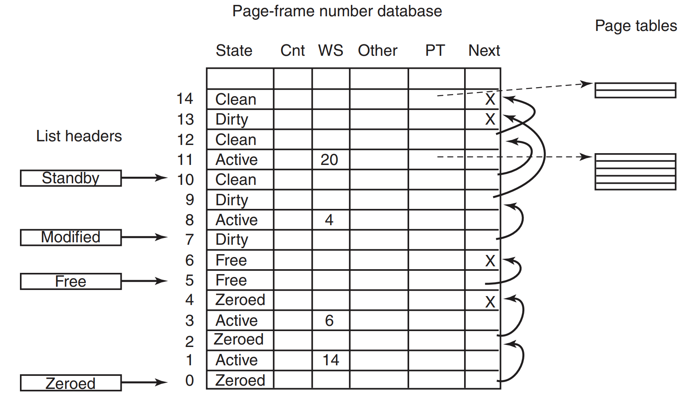

Based on the situation, pages can be moved between the lists. This process is presented below.

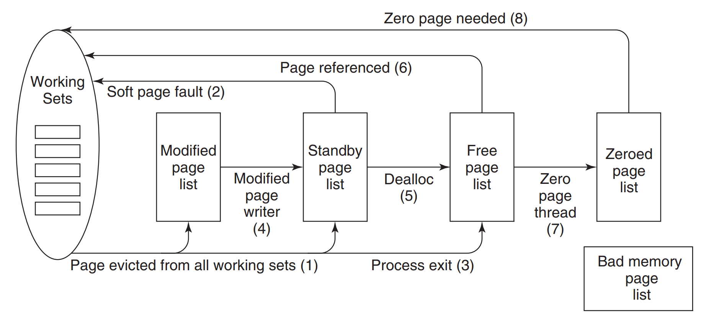

Here is the short description of all the transitions:
1. A page is removed from the working set and goes to stand-by or modified list
2. Soft page fault occurs - in such situation the page is brought back to the working set
3. When process exists, all non-shared pages go to the free page list
4. System threads - **mapped page writer** and **modified page writer** run periodically and check for the number of 
   free clean pages. If they're running low, they take pages from the top of *modified list*, write them back to 
   disk and then move the pages to *standby list*. *The former handles writes to mapped files and
   the latter handles writes to the pagefiles.*
5. Process unmaps a page, and it goes to the free list
6. When a page is needed (as there's some data coming from the disk), it's taken from the *free* list and overwritten
7. **ZeroPage Thread** is running and puts zeroed pages on the *zeroed* list

In general - the decision when to move pages from *modified* to *standby* list are made by the system based on the 
variety of things, including trade-off algorithms, rules of thumb, guesswork, heuristics and all other 
future-guessing things. To end up - modern Windows introduced another layer of abstraction on top of it, called 
**store manager**. It makes decisions about how to make moving data from memory to the backing stores in as little 
*I/O* operations as possible. There's also its colleague - **swap file**, which is a backing store for working set 
pages that are responsible for presenting foreground part of the application. IF the app was not accessed in quite 
some time, it's possible for the **memory manager** to just drop a big part of the working set into this file (in 
one, or several continuous chunks).

### Caching

Caching in this context is related to the file system. In order to speed up the OS work, not the physical addresses of 
the files are cached, but the **regions of files**, and they're stored in the memory (where they're named *views*). 
Main work that **cache manager** performs in this scenario, is to maintain coherence of data between files on the 
disk and memory.

> Let us now examine how the cache manager works. When a file is referenced,
the cache manager maps a 256-KB chunk of kernel virtual address space onto the
file. If the file is larger than 256 KB, only a portion of the file is mapped at a time.
If the cache manager runs out of 256-KB chunks of virtual address space, it must
unmap an old file before mapping in a new one. Once a file is mapped, the cache
manager can satisfy requests for its blocks by just copying from kernel virtual address space to the user buffer. If the block to be copied is not in physical memory,
a page fault will occur and the memory manager will satisfy the fault in the usual
way. The cache manager is not even aware of whether the block was in memory or
not. The copy always succeeds.

### Input/output in Windows

In general **I/O manager** is tightly coupled with **plug&play manager**. Every hardware in the system sooner (eg. 
during boot) or later (eg. when USB is inserted), is contacted by **plug&play manager** and asked to provide 
information about itself. After that is done, a proper driver is loaded and corresponding **driver object** is 
created in the kernel. That process applies not only to the hardware! A lot of software concepts are treated as an 
*I/O* components - antiviruses, network stacks or file systems to name a few. Windows *I/O* supports async execution,
when one thread performs *I/O* operation, and while waiting for it to end, operates in parallel. The way to inform 
the thread about operation end is to use an **event object**, or to have special queue, where completion event will 
be sent after operation is completed.

The last aspect discussed here is **prioritized I/O** - there are five levels of priorities, which are based on the 
issuing thread priority, or set manually. The highest one - **critical** - is reserved for memory manager, **high** 
is usually reserved for multimedia apps (to avoid glitches). **Normal** is default setting where **low** and **very 
low** being assigned to the background processes.

### Input/output API calls

| API function                 |  Description
|------------------------------|---------------------------------------------
| NtCreateFile                 | Open new or existing files or devices
| NtReadFile                   | Read from a file or device
| NtWriteFile                  | Write to a file or device
| NtQueryDirectoryFile         | Request information about a directory, including files
| NtQueryVolumeInformationFile | Request information about a volume
| NtSetVolumeInformationFile   | Modify volume information
| NtNotifyChangeDirectoryFile  | Complete when any file in the directory or subtree is modified
| NtQueryInformationFile       | Request information about a file
| NtSetInformationFile         | Modify file information
| NtLockFile                   | Lock a range of bytes in a file
| NtUnlockFile                 | Remove a range lock
| NtFsControlFile              | Miscellaneous operations on a file
| NtFlushBuffersFile           | Flush in-memory file buffers to disk
| NtCancelIoFile               | Cancel outstanding I/O operations on a file
| NtDeviceIoControlFile        | Special operations on a device

### Implementation of I/O

> The Windows I/O system consists of the plug-and-play services, the device
power manager, the I/O manager, and the device-driver model. Plug-and-play
detects changes in hardware configuration and builds or tears down the device
stacks for each device, as well as causing the loading and unloading of device drivers. The device power manager adjusts the power state of the I/O devices to reduce
system power consumption when devices are not in use. The I/O manager provides support for manipulating I/O kernel objects, and IRP-based operations like
*IoCallDrivers* and *IoCompleteRequest*. But most of the work required to support
Windows I/O is implemented by the device drivers themselves.

**Device drivers** to properly work must comply with **WDM (Windows Driver Model)**. To make sure that driver 
created by external company is compliant, a **WDK (Windows Driver Kit)** contains documentation and examples of 
drivers, which then can be extended if needed. Along that, there's a **driver verifier**, which checks if new driver 
is fully compliant with **WDK**. With all the above mentioned, the authors say that it's still not that easy to 
write drivers for Windows. To help with that a **WDF (Windows Driver Foundation)** is running on top on **WDM**, and 
handles a lot of common functionalities and requirements of the drivers (eg. plug&play or power management). 

To make it even more complicated (it's the 3rd layer of abstraction on top of abstraction), a **UMDF (User-Mode 
Driver Framework)** and **KUDF (Kernel-Mode Driver Framework)** exist, as a part of **WDM**, to support making 
drivers implemented as processes running either in user-space or kernel-space. Devices in Windows are in general 
represented by **device objects**.

> I/O operations are initiated by the I/O manager calling an executive API
*IoCallDriver* with pointers to the top device object and to the IRP representing the
I/O request. This routine finds the driver object associated with the device object.
The operation types that are specified in the IRP generally correspond to the I/O
manager system calls described above, such as *create*, *read*, and *close*.

After the driver finishes processing the request that came with IRP it can do three things:
* call *IoCallDriver* and pass the IRP to the next device
* declare request as completed and return the caller
* send information to the caller that the request is being handled (is in pending state)

Information send with IRP are stored in the specific order and structure. Below picture presents this.

At the bottom of IRP is dynamically-sized array, containing information that can be used by drivers in the stack 
handling the request. 

> The IRP contains flags, an operation code for indexing into the driver dispatch
table, buffer pointers for possibly both kernel and user buffers, and a list of MDLs
(Memory Descriptor Lists) which are used to describe the physical pages represented by the buffers, that is, for DMA
> operations. There are fields used for cancellation and completion operations. The fields in the IRP that are used to queue the
IRP to devices while it is being processed are reused when the I/O operation has
finally completed to provide memory for the APC control object used to call the
I/O manager’s completion routine in the context of the original thread. There is
also a link field used to link all the outstanding IRPs to the thread that initiated
them.

**Driver's stack** was mentioned above a couple of times. The thing is - it's possible for a specific hardware, not 
to be handled by one driver, but a stack of them, in order to separate layers of access or security concerns from 
the hardware-specific tasks. Stacking the drivers gives also the possibility to introduce **filtering drivers**, which 
add additional functionality when IRP is being processed. An example would be encrypting data when writing them to disk.

### The Windows NT file system

Windows supports a couple of different filesystems, going back to legacy MS-DOS *FAT-16* (16bit addresses, partition 
up to 2GB), *FAT-32* (32bit address, up to 2TB partition size) and *NTFS* (64bit addresses, and theoretically sizes 
to 2 power 64). As NTFS is a default filesystem in Windows since XP version, the whole chapter concentrates on it.

#### Fundamental concepts

The name of the file can have up to 256 chars (they're Unicode), and total path size up to *32 767* chars. File 
names are case-sensitive.

> An NTFS file is not just a linear sequence of bytes, as FAT -32 and UNIX files
are. Instead, a file consists of multiple attributes, each represented by a stream of
bytes. Most files have a few short streams, such as the name of the file and its
64-bit object ID, plus one long (unnamed) stream with the data. However, a file
can also have two or more (long) data streams as well. Each stream has a name
consisting of the file name, a colon, and the stream name, as in foo:stream1. Each
stream has its own size and is lockable independently of all the other streams.

#### Implementation of the NT file system

Each NTFS volume (eg. partition) consists of **blocks** (in Windows they're called **clusters**), which can vary in 
size (from 512bytes to 64KB), although the usual size is 4KB. **Blocks** are referred with the offset number, 
counted from the start of the volume (it's stored in the 64bit number). Every object on the disk (file/folder) has 
associated **MFT (Master File Table)**, which contains information as the name, and size in blocks. For large files 
there's sometimes a need to use a couple of them - in such situations first **MFT** (called **base record**) contains a 
link to all others. To make it clear - **MFT** is not a part of the file! It is a separate data structure and can be 
located anywhere on the disk.

The format of **MFT** is presented below. First *16* records are reserved for metadata (with first entry describing 
a **MFT** itself). 

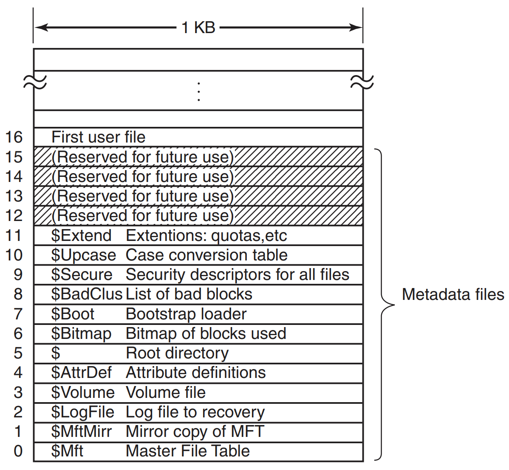

NTFS itself defines 13 attributes that can be used in **MFT** records. Every **attribute header** identifies 
attribute header, its value length and additional flags. Usually the value follows the **header**, but if the value 
is too large it can be put in a separate block (it's called **nonresident attribute**). Some attributes can be 
repeated, although they still have to be placed in a specific order. The **header** size is *24 bytes*. The list of 
attributes is presented below.

| Attribute                |  Description
|--------------------------|---------------------------------------------
| Standard                 | information Flag bits, timestamps, etc.
| File name                | File name in Unicode; may be repeated for MS-DOS name
| Security descriptor      | Obsolete. Security information is now in $Extend$Secure
| Attribute list           | Location of additional MFT records, if needed
| Object ID                | 64-bit file identifier unique to this volume
| Reparse point            | Used for mounting and symbolic links
| Volume name              | Name of this volume (used only in $Volume)
| Volume information       | Volume version (used only in $Volume)
| Index root               | Used for directories
| Index allocation         | Used for ver y large directories
| Bitmap                   | Used for very large directories
| Logged utility stream    | Controls logging to $LogFile
| Data                     | Stream data; may be repeated

The last position on the list is **data**, which is the most important in fact, as it's the data we're interested in 
when looking at a file. Data is placed in **streams** - if the file is small, and it fits right in the attribute, 
the header does not contain its name, and the whole stream is just put as an attribute value (these files are called 
**immediate files). However, when the file is bigger, then the stream name goes into the attribute header, and the 
contents of it is a list of **disk blocks** that actually form the whole file. These files are called **sparse files**.

The OS tries to allocate **disk blocks** that are put in the sequence, without any holes between them. Blocks in a 
stream are described by **records**, which holds information about the continuous sequences of blocks. Every record 
header contains a pair of two numbers - first one is the offset indicating the location in the stream, and 
the second is the end of it. The contents of the stream (divided into *runs*) is also represented by a pair of 
numbers - first one is an offset of the block on the partition it is placed, and a second one is a length of it. Below picture shows that.

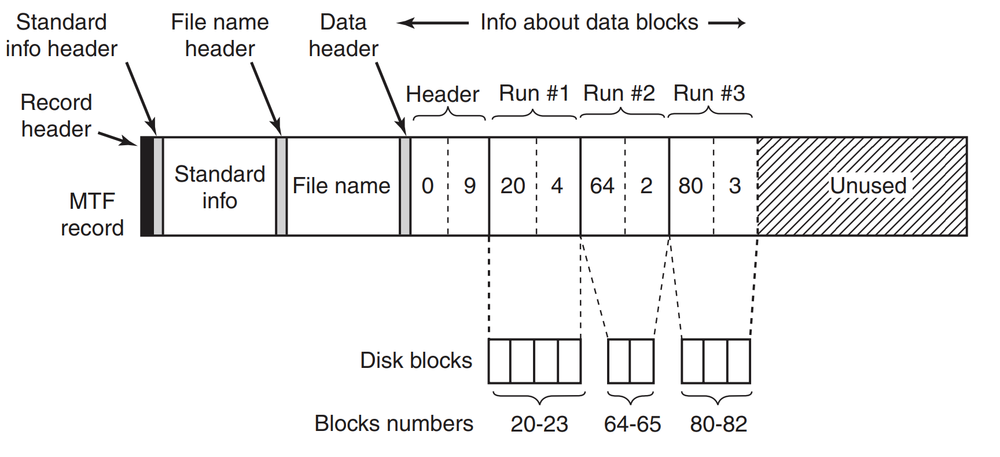

If there's a need for more than one **record** to store information about the file, there's a simple trick to do that.
In the **base MFT record** all the necessary additional **records** are calculated (how many of them is needed), and 
their identifiers are stored in this **base MFT**, followed by the normal *runs*. When first **MFT record** is read, 
a next one is being picked up. It's presented below.

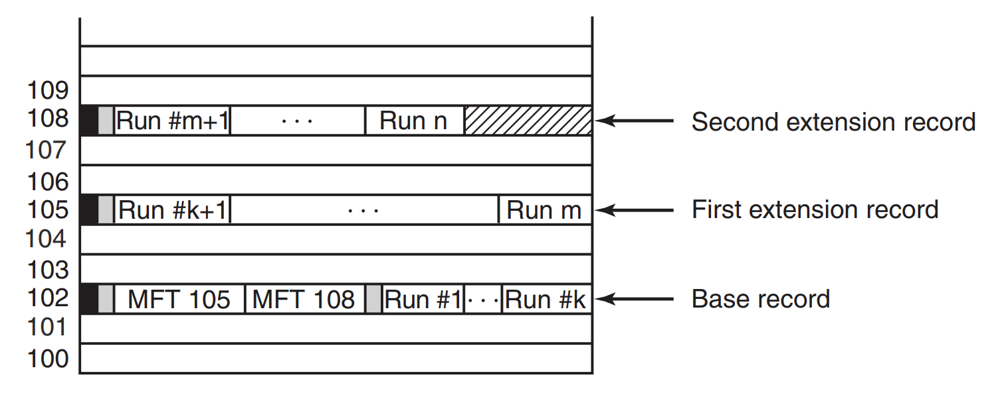

A **MFT record** for a small directory is presented below. The contents of the folder are just presented 
as a list of entries.

For larger directory, a *b-tree* is created, to speed things up. There's an example of how the whole process of 
locating file in the large directory is performed, but I will skip it.

> In addition to regular files and directories, NTFS supports hard links in the
UNIX sense, and also symbolic links using a mechanism called **reparse points**.
NTFS supports tagging a file or directory as a reparse point and associating a block
of data with it. When the file or directory is encountered during a file-name parse,
the operation fails and the block of data is returned to the object manager. The object manager can interpret the data as representing an alternative path name and
then update the string to parse and retry the I/O operation. This mechanism is used
to support both symbolic links and mounted file systems, redirecting the search to
a different part of the directory hierarchy or even to a different partition.

It's also possible for NTFS to actually compress files, without the clients knowledge (**transparent compression**). 
It works simply by parsing the file blocks in chunks of *16*. A compression algorithm is used on the chunk, and if 
after the compression process the size of chunk is a fit for less than *16* blocks, the data is stored in compressed 
form on the disk. If that comparison fails, the data is left intact. Information about compression must be somehow 
stored in the **MFT record**, and it's achieved by introducing indicators of compressed, 'empty' parts. A single 
entry is stored with start offset of *0* (which is impossible to use, as on every volume it's occupied by boot 
sector). Below is a picture presenting uncompressed file being compressed, and **MFT record** of it.

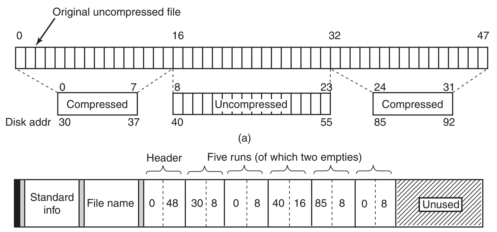

Right at the end of this subchapter we're left with **journaling**. Actually here a quote is the best.

> NTFS supports two mechanisms for programs to detect changes to files and directories. First is an operation, 
> *NtNotifyChangeDirectoryFile*, that passes a buffer and returns when a change is detected to a directory or 
> directory subtree. The result is that the buffer has a list of *change records*. If it is too small, records are lost.
> The second mechanism is the NTFS change journal. NTFS keeps a list of all the change records for directories and 
> files on the volume in a special file, which programs can read using special file-system control operations, that 
> is, the FSCTL_QUERY_USN_JOURNAL option to the *NtFsControlFile API*. The journal file is normally very large, 
> and there is little likelihood that entries will be reused before they can be examined.

### Windows power management

This subchapter is very short, and the main takeaways should be **hibernate state** (all memory dumped to disk, 
*I/O* suspended) and **standby mode** (minimum power consumption, just to keep track of dynamic RAM). A variation of 
the latter is **connected standby**, which is used on laptops and such. It requires additional network hardware and 
from **standby mode** it differs with the ability to 'wake up' also after the receiving a packet on the monitored 
network connection. The whole thing is managed by the **power manager**. 

### Security in Windows 8

Originally, Windows NT was designed to comply with DoD standards in regard to security. Although, Windows 8 was no 
created with that in mind, it still incorporates a lot of security design coming from there.

1. Secure login with antispoofing measures - it requires user to have a password and prevents spoofing attempts
2. Discretionary access controls - owner of the file/folder can say who has access to it
3. Privileged access controls - superuser can override any kind of access rights
4. Address-space protection per process - every process has a separate virtual memory space, not accessible by any 
   other process
5. New pages must be zeroed before being mapped in - we've discussed this in memory-management section
6. Security auditing - producing logs of any security-related issues

#### Fundamental concepts

Every user has **SID (Security ID)** assigned - which is binary number with a header at the beginning. Every process 
that starts running, runs with the **SID** of the user that started it. The main security system is based on the 
notion, that access to the specific objects is restricted only to specific **SIDs**. What is more - each process has 
also a **access token**, that specifies **SID** and a couple of other properties. The structure of it is 
presented below.

The structure contains:
* **expiration time** - it's not used currently 
* **groups** - groups process belongs to (to comply with POSIX) 
* **default CACL** - default ACL assigned to the process when there's no specific one provided 
* **user SID** 
* **group SID** 
* **restricted SIDs** - 
* **privileges** - specific super-admin rights that process can be assigned  
* **impersonation level** - described later
* **integrity level** - described later

Upon logon of the user, initial process is given a **security token**, and then it is passed down to the child 
processes and threads. However, it's possible for a thread to acquire its own **security token**, and override 
process' one. It's also possible for the client thread to pass its **token** to server thread, in order for the 
latter to get access to user's resources. This process is called **impersonation**. 

Next concept is **security descriptor**, which is a construct assigned to every object. It says who can perform 
operations on the object. Every **descriptor** has a header, and a list of **DACL (Default ACLs)** that has one ore 
more **ACEs (Access Control Entries)**, where the most used are allow and deny. **SACL** is placed at the end - 
specifying which operations on the object should be stored in the system log of security events. The whole 
**descriptor** structure is depicted below.

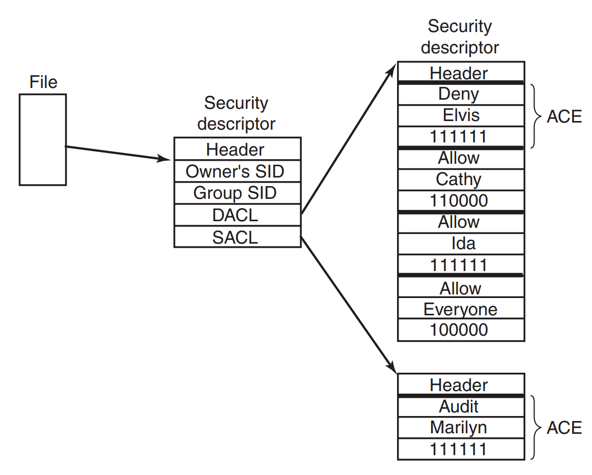

#### Security API calls

In general *Win32 API* for security is based on the **security descriptor**, which is passed when process creates an 
object. If not such **descriptor** is provided, a default one from **access token** is passed. Below is a short list 
of methods that are mostly used to setup **descriptors**.

| Win32 API function              |  Description
|---------------------------------|---------------------------------------------
| InitializeSecurityDescriptor    | Prepare a new security descriptor for use
| LookupAccountSid                | Look up the SID for a given user name
| SetSecurityDescriptorOwner      | Enter the owner SID in the security descriptor
| SetSecurityDescriptorGroup      | Enter a group SID in the security descriptor
| InitializeAcl                   | Initialize a DACL or SACL
| AddAccessAllowedAce             | Add a new ACE to a DACL or SACL allowing access
| AddAccessDeniedAce              | Add a new ACE to a DACL or SACL denying access
| DeleteAce                       | Remove an ACE from a DACL or SACL
| SetSecurityDescriptorDacl       | Attach a DACL to a security descriptor

#### Implementation of security

> Security in a stand-alone Windows system is implemented by a number of
components, most of which we have already seen (networking is a whole other
story and beyond the scope of this book). Logging in is handled by *winlogon* and
authentication is handled by *lsass*. The result of a successful login is a new GUI shell (*explorer.exe*) with its 
> associated *access token*. This process uses the **SECURITY** and **SAM** hives in the registry. The former sets the 
> general security policy, and the latter contains the security information for the individual users [...]

It was described above that when an object is created by the process, all the necessary security information is 
passed then. With every object created a **handler** is being returned to the caller, and on the subsequent calls to 
this object there's a comparison of currently invoked operation, and allowed/denied ones passed upon creation. 
Authors provide file access as an example - even if opened for read only, we have to check every time if the process 
does not try to write to it.

The concept that was mentioned before (when presenting **access token**), but not described at all was 
**integrity-level SID**. The idea here is simple - this is 'not-overridable flag'. No matter what is in the 
**DACLs** - if **integrity level** is eg. low, there's no way the process will be able to write/change the object. 
An example provided by the author here is infamous *Internet Explorer*, to prevent it from damaging the system (when 
accessing some untrusted software/pages).   

Below is a list of smaller security improvements discussed in this subchapter:
* starting from *Windows XP*, it's being compiled with */GS* flag, that prevents many stack-overflow attacks. An 
  additional layer of security in this regard is related to the *x64 NX* bit, that disables a possibility of 
  executing the code located in some memory pages.
* *Windows Vista* introduced putting in the kernel only parts of the software that were signed by the trusted 
  authority. Also, the addresses where EXE and DLLs are loaded are shuffled from time to time, again, to prevent 
  buffer overflow attacks.
* **UAC (User Access Control)** is a mechanism, that protects the system from very different threats, when user is 
  logged as an administrator. We've all been there probably - on Windows it was hard sometimes to operate as 
  'normal' user, so usually all the accounts in the system had administrator rights. With such approach (imagine 
  users logged to the Linux machines as root all the time!) it was easy for malicious software to seriously damage 
  the system. With **UAC** it's way harder, as for every action that requires admin rights, a special desktop is run 
  and it needs confirmation from currently logged user to move further.
  

#### Security mitigations

At the end of the whole chapter, a list of **mitigations** is presented, which actually sums up previous subchapter 
and adds some more techniques that are used for security in the system.

| Mitigation           |  Description
|----------------------|---------------------------------------------
| /GS compiler flag    | Add canary to stack frames to protect branch targets
| Exception hardening  | Restrict what code can be invoked as exception handlers
| NX MMU protection    | Mark code as non-executable to hinder attack payloads
| ASLR                 | Randomize address space to make ROP attacks difficult
| Heap hardening       | Check for common heap usage errors
| VTGuard              | Add checks to validate virtual function tables
| Code Integrity       | Verify that libraries and drivers are properly cryptographically signed
| Patchguard           | Detect attempts to modify kernel data, e.g. by rootkits
| Windows Update       | Provide regular security patches to remove vulnerabilities
| Windows Defender     | Built-in basic antivirus capability